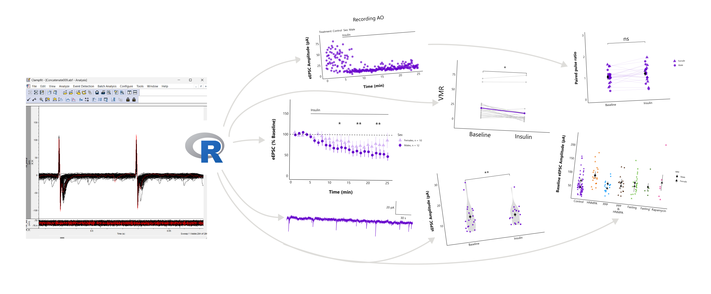

<!-- README.md is generated from README.Rmd. Please edit that file -->

```{r, include = FALSE}
knitr::opts_chunk$set(
  collapse = TRUE,
  comment = "#>",
  dpi = 300,
  dev = "png",
  fig.path = "man/figures/README-",
  out.width = "100%"
)
```

# patchclampplotteR 

<!-- badges: start -->
<!-- badges: end -->


```{r header-image, fig.align = 'center', fig.alt = "A banner with pictures of some of the plots that can be created with the patchclampplotteR package.", echo=F}

```

The goal of `patchclampplotteR` is to create a set of user-friendly tools for
electrophysiologists who want to plot and analyze data from whole-cell patch
clamp electrophysiology recordings. Here's some of the functions that this
package can do (see below for examples!):

* Plot raw evoked or spontaneous current amplitudes over time for all recordings at once.
* Normalize current amplitudes relative to mean baseline values.
* Plot normalized current amplitudes over time for all recordings.
* Plot summary data for a specific treatment, grouped by sex.
* Plot representative spontaneous current traces from an .abf file with a scale bar.
* Compare spontaneous current amplitude and frequency
* Compare variance parameters to help determine presynaptic mechanisms.
* And more!

```{r include=FALSE}
library(patchclampplotteR)
```


## Quick Examples

Plot raw evoked currents for a specific cell:

```{r example-raw-eEPSC-plot}
raw_eEPSC_control_plots <- plot_raw_current_data(
  data = sample_raw_eEPSC_df,
  plot_treatment = "Control",
  plot_category = 2,
  current_type = "eEPSC",
  parameter = "P1",
  pruned = "no",
  hormone_added = "Insulin",
  hormone_or_HFS_start_time = 5,
  theme_options = sample_theme_options,
  treatment_colour_theme = sample_treatment_names_and_colours
)

raw_eEPSC_control_plots$AO
```
Plot evoked current amplitudes summarized by sex:  


```{r example-summary-eEPSC-plot}
plot_summary_current_data(
  plot_category = 2,
  plot_treatment = "Control",
  data = sample_pruned_eEPSC_df$all_cells,
  current_type = "eEPSC",
  parameter = "amplitude",
  include_representative_trace = "no",
  signif_stars = "yes",
  t_test_df = sample_eEPSC_t_test_df,
  hormone_added = "Insulin",
  large_axis_text = "no",
  shade_intervals = "no",
  hormone_or_HFS_start_time = 5,
  treatment_colour_theme = sample_treatment_names_and_colours,
  theme_options = sample_theme_options
)
```

Plot a representative recording trace showing spontaneous currents:

```{r example-spontaneous-current-trace-plot}
plot_spontaneous_current_trace(
  file = sample_abf_file,
  plot_colour = "#6600cc",
  include_scale_bar = "yes",
  plot_episode = "epi1",
  scale_bar_x_length = 1,
  scale_bar_y_length = 10,
  plot_x_min = 1,
  plot_x_max = 3
)
```

## Installation

You can install the development version of patchclampplotteR from
[GitHub](https://github.com/) with:

```{r install-package-demo, warning=FALSE, message=FALSE}
# install.packages("pak")
pak::pak("christelinda-laureijs/patchclampplotteR")
```

And then load the package with `library()`:

```{r load-library}
library(patchclampplotteR)
```
