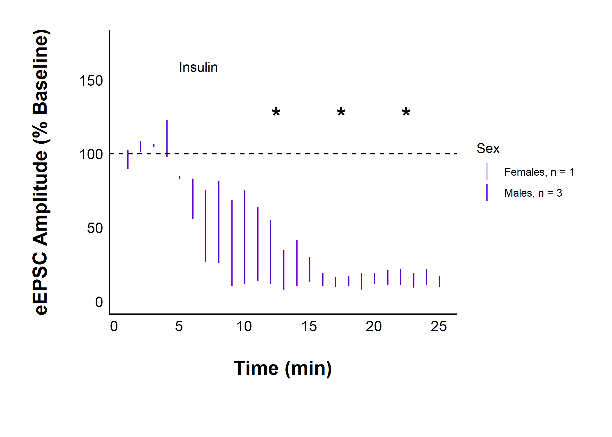
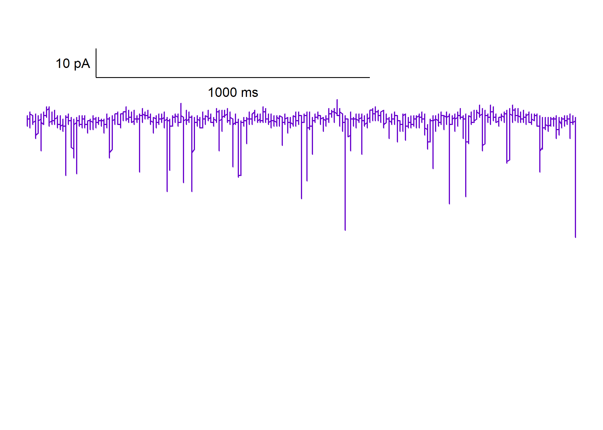
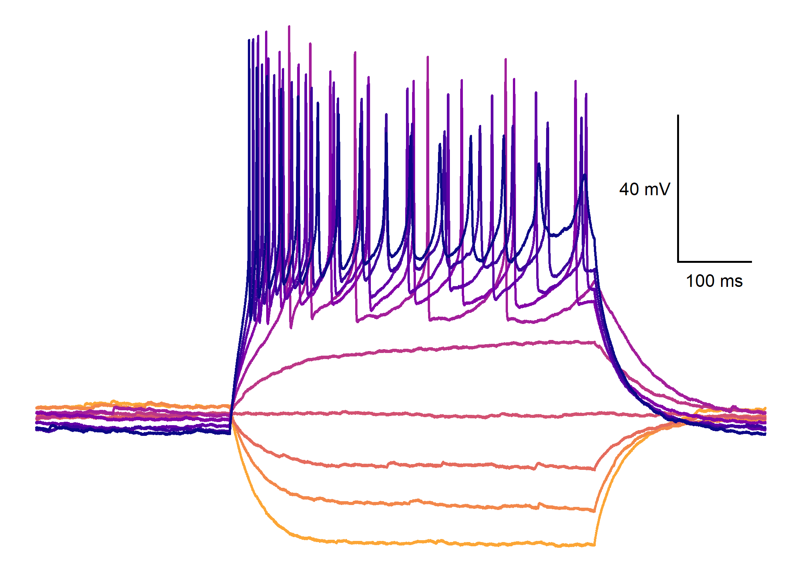
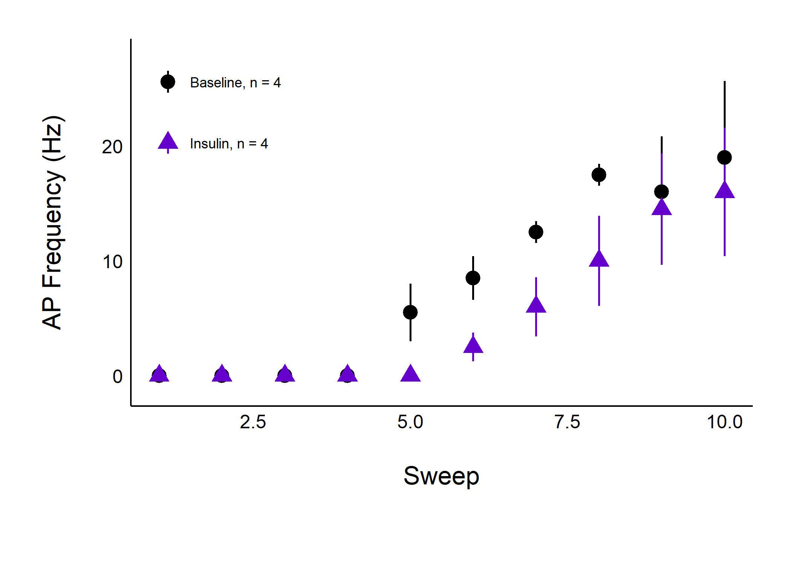

<!-- README.md is generated from README.Rmd. Please edit that file -->

# patchclampplotteR 

<!-- badges: start -->
<!-- badges: end -->

<span style="color:#55b323;font-weight:bold;">patch</span><span style="color:#6600cc;font-weight:bold;">clamp</span><span style="color:
black;font-weight:bold;">plotte</span><span style="color:#0093fb;font-weight:bold;">R</span>
provides a set of user-friendly tools for electrophysiologists who want
to plot and analyze data from whole-cell patch clamp electrophysiology
recordings. Here’s some of the functions that this package can do (see
below for examples!):


- Plot raw evoked or spontaneous current amplitudes over time for all
  recordings at once.
- Normalize current amplitudes relative to mean baseline values.
- Plot normalized current amplitudes over time for all recordings.
- Plot summary data for a specific treatment, grouped by sex.
- Plot representative spontaneous current traces from an .abf file with
  a scale bar.
- Compare spontaneous current amplitude and frequency
- Compare variance parameters to help determine presynaptic mechanisms.
- And more!

## Examples

Plot raw evoked currents for a specific cell:

``` r
raw_eEPSC_control_plots <- plot_raw_current_data(
  data = sample_raw_eEPSC_df,
  plot_treatment = "Control",
  plot_category = 2,
  current_type = "eEPSC",
  y_variable = "P1",
  pruned = "no",
  hormone_added = "Insulin",
  hormone_or_HFS_start_time = 5,
  theme_options = sample_theme_options,
  treatment_colour_theme = sample_treatment_names_and_colours
)

raw_eEPSC_control_plots$AO
```


Plot evoked current amplitudes summarized by sex:

``` r
plot_summary_current_data(
  data = sample_pruned_eEPSC_df$all_cells,
  plot_category = 2,
  plot_treatment = "Control",
  current_type = "eEPSC",
  y_variable = "amplitude",
  hormone_added = "Insulin",
  hormone_or_HFS_start_time = 5,
  included_sexes = "both",
  include_representative_trace = "yes",
  representative_trace_filename = import_ext_data("Control-trace.png"),
  y_axis_limit = 175,
  signif_stars = "yes",
  significance_display_method = "stars",
  t_test_df_male = sample_eEPSC_t_test_df_male,
  t_test_df_female = sample_eEPSC_t_test_df_female,
  stars_position_male = 30,
  stars_position_female = 70,
  stars_colour_male = "#6600cc",
  stars_colour_female = "#d6b8f5",
  large_axis_text = "no",
  shade_intervals = "no",
  treatment_colour_theme = sample_treatment_names_and_colours,
  theme_options = sample_theme_options
)
```



Plot a representative recording trace showing spontaneous currents from
a raw Axon Binary File (.ABF):

``` r
plot_spontaneous_current_trace(
  data = sample_abf_file,
  plot_colour = "#6600cc",
  plot_category = 2,
  plot_treatment = "Control",
  state = "Baseline",
  plot_episode = "epi1",
  trace_annotation = "Baseline",
  geom_text_colour = "#6600cc"
)
```



Plot action potential traces…

``` r
plot_AP_trace(
  data = sample_ap_abf_baseline,
  sweeps = as.character(unique(sample_ap_abf_baseline$episode)),
  colour_scale_option = "viridis",
  plot_category = 2,
  plot_treatment = "Control",
  direction = -1,
  option = "plasma",
  begin = 0,
  end = 0.8
)
```



…and a summary of differences in action potential frequency across
treatments.

``` r
plot_AP_frequencies_single_treatment(
  data = sample_AP_count_data,
  plot_treatment = "Control",
  plot_category = 2,
  baseline_label = "Baseline",
  hormone_added = "Insulin",
  treatment_colour_theme = sample_treatment_names_and_colours,
  significance_display_method = "stars",
  large_axis_text = "no",
  test_type = "wilcox.test",
  theme_options = sample_theme_options,
  save_plot_png = "no"
)
```



## Installation

You can install the development version of patchclampplotteR from
[GitHub](https://github.com/) with:

``` r
# install.packages("pak")
pak::pak("christelinda-laureijs/patchclampplotteR")
```

And then load the package with `library()`:

``` r
library(patchclampplotteR)
```

## Analysis

To learn about how to convert raw .abf data in Clampfit to .csv files
for this package, please see the vignettes [Evoked Current
Analysis](https://christelinda-laureijs.github.io/patchclampplotteR/articles/evoked-current-analysis.html),
[Spontaneous Current
Analysis](https://christelinda-laureijs.github.io/patchclampplotteR/articles/spontaneous-current-analysis.html),
and [Action Potential
Analysis](https://christelinda-laureijs.github.io/patchclampplotteR/articles/action-potential-analysis.html).

## Using patchclampplotteR

Please see the [Getting
Started](https://christelinda-laureijs.github.io/patchclampplotteR/articles/patchclampplotteR.html)
page for a walk-through of the major functions of this package.

If you want to learn tips and tricks for customizing your plots, please
see the
[FAQ](https://christelinda-laureijs.github.io/patchclampplotteR/articles/FAQ.html)
page!
