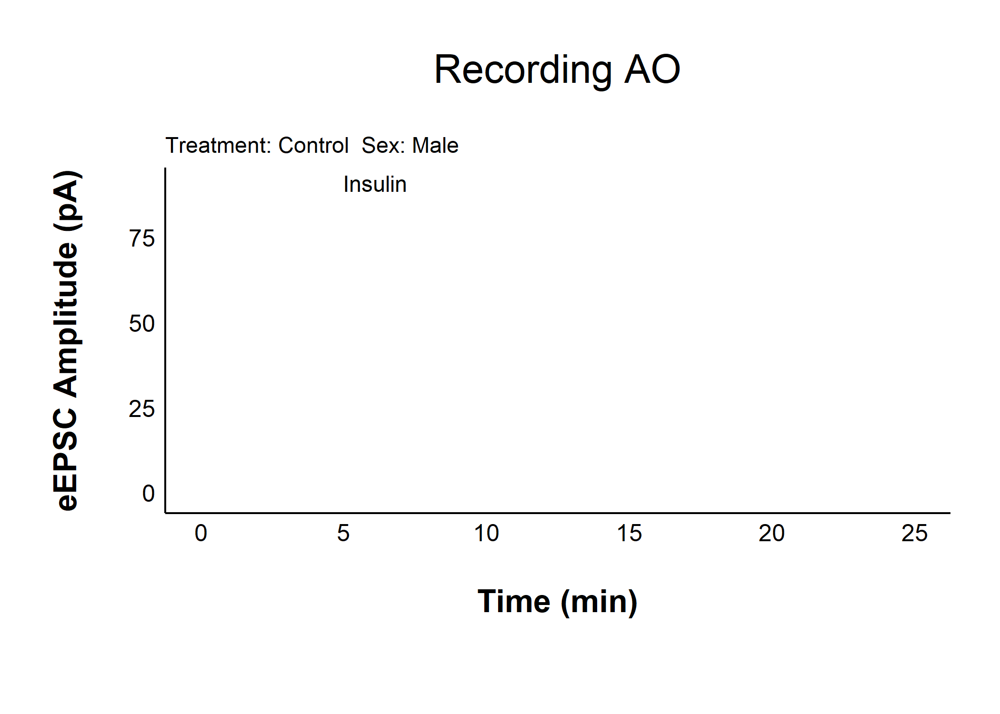

<!-- README.md is generated from README.Rmd. Please edit that file -->

# patchclampplotteR: Plot and analyze patch clamp data

<!-- badges: start -->
<!-- badges: end -->

The goal of patchclampplotteR is to create a set of user-friendly tools
for electrophysiologists who want to plot and analyze data from
whole-cell patch clamp electrophysiology recordings. Here’s some of the
functions that this package can do:

- Plot raw evoked or spontaneous current amplitudes over time for all
  recordings at once.
- Normalize current amplitudes relative to mean baseline values.
- Plot normalized current amplitudes over time for all recordings.
- Plot summary data for a specific treatment, grouped by sex.
- Plot representative spontaneous current traces from an .abf file with
  a scale bar.
- Compare spontaneous current amplitude and frequency
- Compare variance parameters to help determine presynaptic mechanisms.
- And more!

## Installation

You can install the development version of patchclampplotteR from
[GitHub](https://github.com/) with:

``` r
# install.packages("pak")
pak::pak("christelinda-laureijs/patchclampplotteR")
```

And then load the package with `library()`:

``` r
library(patchclampplotteR)
```

## Quick Examples

Plot raw evoked currents for a specific cell:

``` r
raw_eEPSC_control_plots <- plot_raw_current_data(
  data = sample_raw_eEPSC_df,
  plot_treatment = "Control",
  plot_category = 2,
  current_type = "eEPSC",
  parameter = "P1",
  pruned = "no",
  hormone_added = "Insulin",
  hormone_or_HFS_start_time = 5,
  theme_options = sample_theme_options,
  treatment_colour_theme = sample_treatment_names_and_colours
)

raw_eEPSC_control_plots$AO
```


