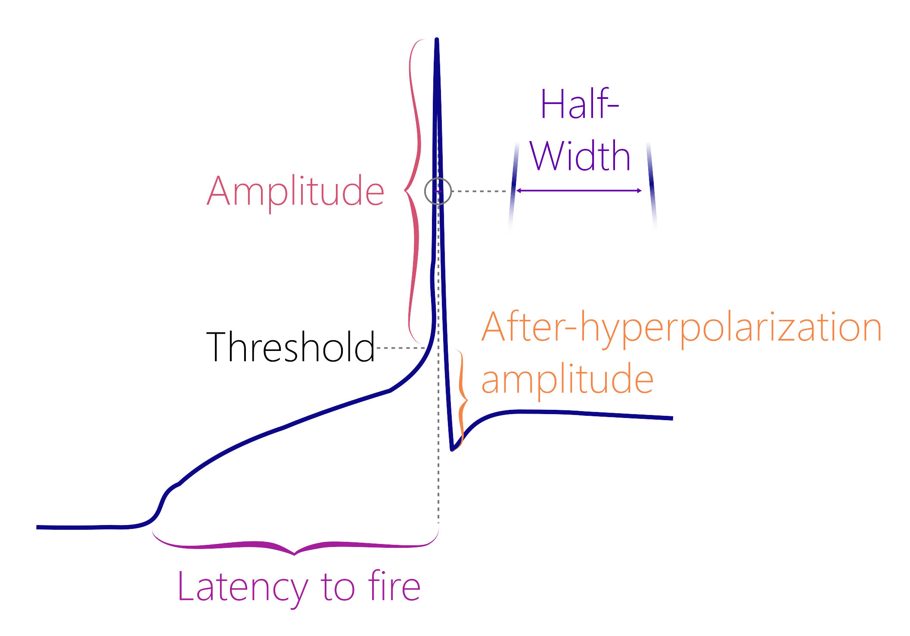
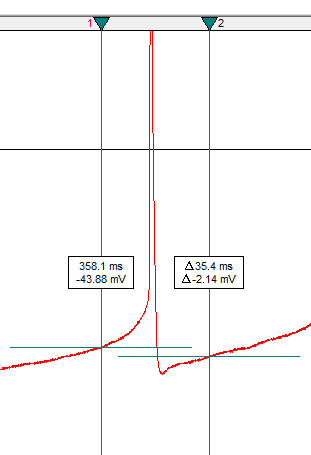
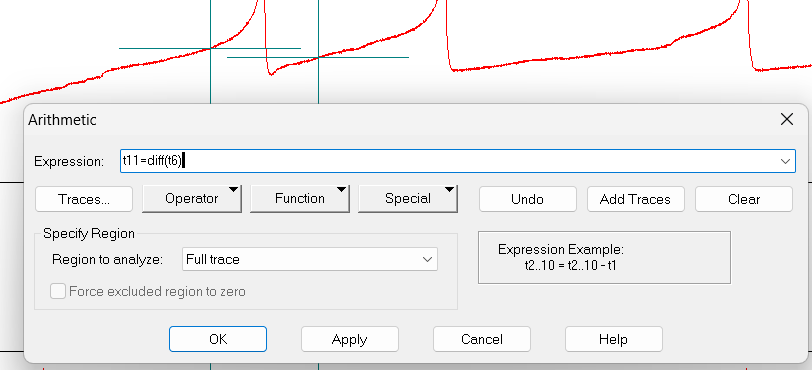
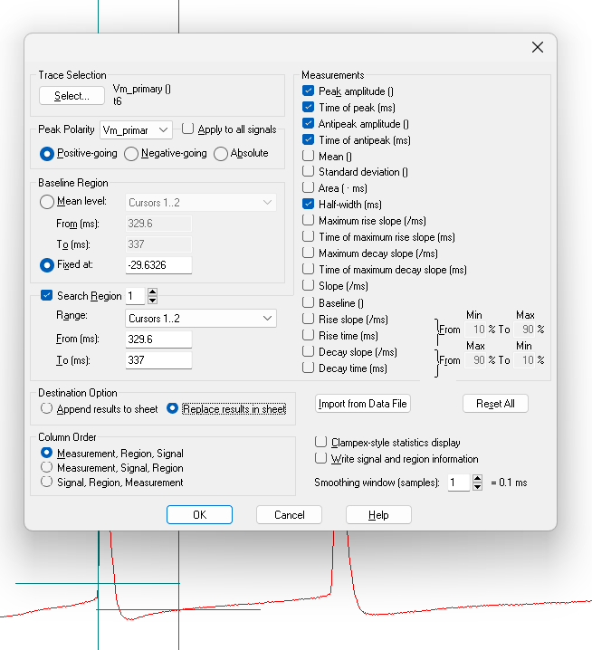

```{r, include = FALSE}
knitr::opts_chunk$set(
  collapse = TRUE,
  comment = "#>"
)

library(dplyr)
library(reactable)
```

# Action Potential Analysis

> Note: This package does not yet contain functions to analyze and plot action potential data. However, I am including this vignette here to show you how to perform raw data analysis in Clampfit. The resulting data will be ready to use in future package versions.

This vignette will demonstrate how to analyze action potential properties using a raw .abf file. You will identify the first current injection that resulted in action potentials and then select the first action potential within this sweep for further analyses.

```{r header-image, fig.align = 'center', fig.alt = "An image of a current clamp steps recording with the first action potential outlined with a box.", echo=F}
knitr::include_graphics("figures/AP-first-trace.png")
```

> You will identify the threshold using the first derivative method. This means that the threshold corresponds to the membrane potential where the action potential velocity is 10 mV/ms or greater (Farries et al., 2010).

## Action Potential Properties

Before you begin, you should set up a .csv file with the following columns:

* `Letter` The unique letter identifier of a single cell. You can use this to link data from different recordings taken from the same cell.
* `State` Must be `Baseline` or `Post`, indicating a current clamp protocol taken after a hormone has been added or some other modification has taken place.
* `Time_of_Threshold` A numerical value (in ms) used to determine properties like the latency to fire.
* `t_x` The membrane potential at the moment that an action potential is initiated, also known as the threshold.
* `t_11` The derivative of the trace you are analyzing. Must be 10 or greater to properly identify the threshold.
* `ID` A character value indicating the recording number. This corresponds to the `File Name` column that is automatically generated in the Results sheet in Clampfit.
* `First_sweep_with_APs` A handy column containing the sweep number where action potentials first appeared (going from the lowest current injection to the highest, identify this sweep visually).
* `Trace_start` This is an automatic value calculated by Clampfit, and it corresponds to the sweep number. It is not used in any analyses, but it will automatically come with the analysis.
* `Peak_amplitude` The membrane potential (in mV) during maximum depolarization.
* `Time_to_Peak`The time of the peak amplitude, which should be relative to the `Time_of_Threshold` if you have repositioned Cursor 1 to the `Time_of_Threshold`.
* `Antipeak_amplitude` The afterhyperpolarization amplitude (in mV)
* `Time_of_antipeak` The time of the after-hyperpolarization, which should be relative to the `Time_of_Threshold` if you have repositioned Cursor 1 to the `Time_of_Threshold`.
* `Half-width` The width of the action potential when the membrane potential is half of the `Peak_amplitude`.

```{r ap-properties-image, fig.align = 'center', fig.alt = "An image of an action potential with labels indicating properties such as the peak amplitude, half-width, after-hyperpolarization, and latency to fire.", echo=F}

```

# Clampfit Tutorial

## Get derivative

1. Open the .abf file containing the current clamp step protocol.
2. Press the “Enter” key to show just one sweep at a time. It will begin at the sweep corresponding to the lowest current injection. Use greater than symbol (>; on some computers you don’t even need to press the shift key) to cycle up through the sweeps.
3. Move up to sweeps corresponding to higher current injections until you identify the first sweep that contains an action potential. This will be named `t_x`, since it may be `t_5` in one recording, or `t_6` in another, etc. 
4. Position cursors 1 and 2 around the first action potential in `t_x`. Cursor 1 should be before the threshold (aim for the area before the slope of the curve increases steeply). Cursor 2 should be in the after-hyperpolarization region.

> It is important that cursor 2 touches the curve at a value that is lower than the voltage value for cursor 1. If cursor 1 is lower, then Clampfit may identify the location at cursor 1 as the after-hyperpolarization region.

```{r cursor-image, fig.align = 'center', fig.alt = "A screenshot of Clampfit showing cursors positioned around the first action potential. The first cursor is located at a point with a y-axis value that is greater than cursor 2.", echo=F}

```

5. Click on the arithmetic button (it is the button with basic math symbols), then Add Traces. Write "1" and click OK. This will add a new empty trace, called `t_11`.

6. `t_11` should be the derivative of `t_x`. In the `Expression` box, write `t11=diff(t6)` (replace `t6` with your value for `t_x`). 

```{r expression-image, fig.align = 'center', fig.alt = "A screenshot of the Arithmetic box of Clampfit showing the formula t11=diff(t6) inserted into the expression field.", echo=F}

```

## Find threshold

7. Click on `Edit` -> `Transfer Traces` and set the `Region to transfer` as `Cursors 1..2`. In the `Trace Selection` category, choose only `Vm_primary ()` as the signal. Select `t_x` and `t_11` for the traces, then click OK.

8. The `Results` page will display three columns: `Time (ms)`, `Trace #6 (or #5, #4, etc.)`, and `Trace #11`. In this example, the middle column is `Trace #6`, but this name will vary depending on the data. `Trace #6` is the membrane potential in mV, and `Trace #11` is the derivative of `Trace #6`.

> Warning: The Results page of the transferred traces does not clear between files. If you are doing several analyses in one session, ensure that you are looking at the correct columns with the traces corresponding to the active recording.

9. Scroll down the `Trace #11` column (the derivative column) until you see the first value that is greater than or equal to 10 mV/ms. Copy the value of all three columns.

10. Your .csv file should now look like this:

```{r echo=FALSE}
sample_ap_data <- data.frame(
  Letter = c("A"),
  State	= c("Baseline"),
  Time_of_Threshold = c(239.6001),
  t_x = c(-29.63256836),
  t_11 = c(67.13457489)
)

reactable(sample_ap_data)
```

## Measure AP properties

11. Double-click on Cursor 1 and change its Time value to match the `Time_of_Threshold`.

> Warning! If you do not reposition Cursor 1 to be at the time of threshold, the values for `Time_of_Peak` and `Time_of_Antipeak` will be incorrect!

12. Click on the Statistics button (a small icon with a summation symbol \u2211 on top of it) or press `Alt+s`.

13. Set the following settings:
* Trace Selection: Choose `Vm_primary ()` and `t_x` (in this case, `t6`)
* Peak Polarity: Vm_primary, Positive-going
* Baseline Region: Fixed at [paste in the threshold value]
* Search Region 1: Range: Cursors 1..2
* Destination Option: Replace results in sheet (prevents you from accidentally copying old data
* Column Order: Measurement, region, Signal
* Measurements: Peak_amplitude, Time of peak, Antipeak amplitude, Time of antipeak, Half-width

```{r statistics-box, fig.align = 'center', fig.alt = "A screenshot of the Statistics box of Clampfit showing the correct options to select.", echo=F}

```

14. Select all data except for the filepath option (unless you think you will need it later) and paste it into the .csv file. You'll notice that the .csv column names are different than the column names in the `Results` sheet. I changed these column names to make them easier to use in R code.

15. Your .csv file should now look like this.

```{r finalized-ap-table, echo=FALSE}
sample_ap_data_2 <- data.frame(
  Letter = c("A"),
  State	= c("Baseline"),
  Time_of_Threshold = c(239.6001),
  t_x = c(-29.63256836),
  t_11 = c(67.13457489),
  ID = c("23714007.abf"),
  First_sweep_with_APs = c(6),
  Trace_start = c(5021),
  Peak_amplitude = c(77.667),
  Time_to_Peak = c(0.5),
  Antipeak_amplitude = c(-17.3034),
  Time_of_antipeak = c(3),
  Half_width = c(0.79088)
)

reactable(sample_ap_data_2)
```

## Count APs

16. The next step is to count action potentials per sweep


References

Farries, M. A., Kita, H., & Wilson, C. J. (2010). Dynamic Spike Threshold and Zero Membrane Slope Conductance Shape the Response of Subthalamic Neurons to Cortical Input. Journal of Neuroscience, 30(39), 13180–13191. https://doi.org/10.1523/JNEUROSCI.1909-10.2010
