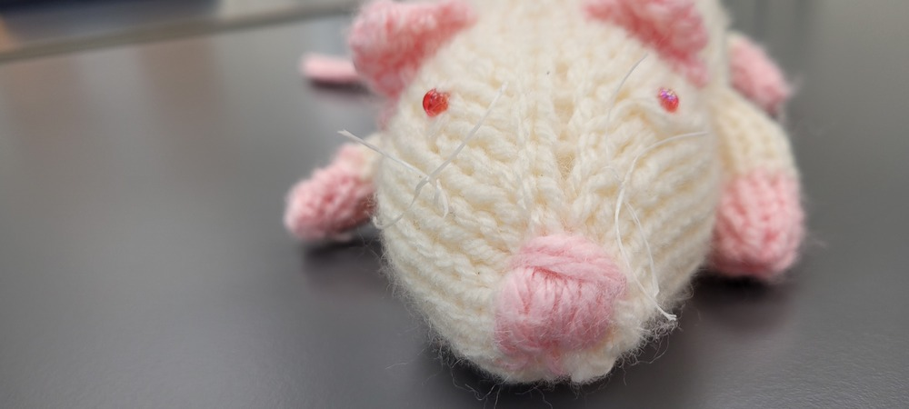

```{r faq-setup, include = FALSE}
knitr::opts_chunk$set(
  collapse = TRUE,
  fig.align = "center",
  comment = "#>"
)

library(ggplot2)
library(patchclampplotteR)
library(here)
library(reactable)
```

# Plotting FAQ

This article contains answers to common questions about plots and customizing
the ggplot output of functions like `plot_raw_current_data()`.

> *Note*: Above all, if you are confused about how a function works, be sure to check the help page for that function! If you type `?` and the name of the function in the R console, it will bring up the help page for the function. For example, type `?plot_AP_trace` to get information on how to use this function.

> There are often extra arguments not included in the examples that you may find helpful if you need to re-adjust parameters like the image position in `plot_summary_current_data()` or the bracket line width.

This is the plot we will use throughout the FAQ:

```{r cars-plot-initial, fig.alt="A scatterplot of stopping distance in feet versus speed in miles per hour. The graph is a plain scatterplot with no background or gridlines."}
cars_plot <- ggplot(cars, aes(x = speed, y = dist)) +
  geom_point() +
  labs(x = "Speed (mph)", y = "Distance (ft)") +
  patchclampplotteR_theme()

cars_plot
```


## How do I save my plots outside of R?

Most plots have an argument called `save_png`, which you can set to "yes" or
"no" (the default is "no" to cut down on run time). If `save_png` is set to
"yes", this will save the plot as a `.png` using `ggsave()` and export it to a
folder. The subfolder will vary depending on the plot type. For example, all
plots generated using `plot_PPR_data_one_treatment()` will be exported to
"Figures/Evoked-currents/PPR" relative to your project directory. If you want
further control over the export options, you can also use `ggsave()` to manually
save a ggplot object. 

```{r ggsave-example, eval=F}
ggsave(
  cars_plot,
  path = here("Figures/Raw-plots"),
  file = "cars-plot.png",
  width = 7,
  height = 5,
  units = "in",
  dpi = 300
)
```


## How do I change the plot text sizes? 

A quick fix for making the text bigger is the `large_axis_text` argument. Set
`large_axis_text` to "yes" to add a ggplot theme layer which increases and
adjusts the plot to be ideal for posters or presentations. If you want more
control over the font sizes,  you can also apply a new `theme()` layer and
specify the text elements manually. For example:

```{r magenta-text, fig.alt="A scatterplot of stopping distance in feet versus speed in miles per hour. The graph is a plain scatterplot with no background or gridlines, but the axis title text is now coloured magenta."}
cars_plot +
  theme(text = element_text(size = 25, color = "darkmagenta"))
```

## How do I change the plot font family?

This can be tricky and it will vary depending on your operating system. I would
recommend using the `extrafont` package. You will need to run the code below the
first time you do this. Use `fonts()` to see the list of fonts available to you in R.

> **Warning!** font_import() will take a long time to
run, especially if you have a lot of fonts on your computer. Luckily, you only
need to do this once per system, or after you install a new font.

> If the `extrafont` package does not work, there are newer alternatives, such as the `showtext` package, which makes it particularly easy to add Google fonts and system fonts.

```{r extrafont, eval=F, results=F}
library(extrafont)
font_import()

fonts()
```

If you already have the fonts installed in R, you just need to run
`library(extrafont)` at the start of your document to have the fonts available to use.

```{r extrafont-calibri-example, eval=F}
cars_plot +
  theme(text = element_text(size = 25, color = "darkmagenta", family = "Calibri"))
```

To apply these theme changes globally (i.e. all plots in your file), it will be much more efficient to modify and define a theme. See below!

## How do I modify the ggplot theme?

You might wonder things like, "How can I override the default theme that came with this package?" or "How can I make all my plots have the same theme/fonts, etc.?". You can fix this efficiently by defining a custom ggplot theme and adding this to the `ggplot_theme` argument in all plotting functions.

Choose a theme like `theme_classic()` or the `patchclampplotteR_theme()` that came with this package. Use this theme as a base, and add new theme elements to replace just the components you want to change (see [the documentation on theme modification in ggplot2](https://ggplot2.tidyverse.org/reference/theme.html). The new theme that you define will inherit all components of the base theme, but replace just the elements that you specified.

> **Important!** You must assign this theme to a name, since the `ggplot_theme` argument requires a named object. In this example, I will creatively call it `my_new_theme`.

```{r my-new-theme-definition}
my_new_theme <- patchclampplotteR_theme() %+replace%
  theme(
    text = element_text(size = 25, color = "#333333"),
    axis.title = element_text(face = "plain", size = 14),
    panel.grid.major = element_line(color = "#ebebeb"),
    axis.text = element_text(face = "italic", size = 8, color = "#999999"),
    axis.line = element_blank()
  )
```

```{r cars-plot-new-theme, fig.alt="A scatterplot of stopping distance in feet versus speed in miles per hour. The graph has a new theme that makes it have gridlines in the background and no axis lines. The axis text is now a pale gray colour."}
cars_plot + my_new_theme
```

Now, insert this theme into the `ggplot_theme` argument. This is one of the sample action potential plots with the default theme applied:

```{r plot-ap-comparison-old-theme, fig.alt="A scatterplot showing peak amplitude in pico amps versus experiment state (baseline or insulin) on the x-axis. The default patchclampplotteR theme has been applied, so it has a plain background and bold black axis lines."}
plot_AP_comparison(
  sample_AP_data,
  plot_treatment = "Control",
  plot_category = 2,
  y_variable = "peak_amplitude",
  y_axis_title = "Peak Amplitude (pA)",
  theme_options = sample_theme_options,
  baseline_label = "Baseline",
  test_type = "wilcox.test",
  post_hormone_label = "Insulin",
  treatment_colour_theme = sample_treatment_names_and_colours,
  save_plot_png = "no",
  ggplot_theme = patchclampplotteR_theme()
)
```


Here's what the same plot looks like with the new theme:

```{r plot-ap-comparison-new-theme, fig.alt="A scatterplot showing peak amplitude in pico amps versus experiment state (baseline or insulin) on the x-axis. The new theme has been applied, so the graph has a pale grid in the background."}
plot_AP_comparison(
  sample_AP_data,
  plot_treatment = "Control",
  plot_category = 2,
  y_variable = "peak_amplitude",
  y_axis_title = "Peak Amplitude (pA)",
  theme_options = sample_theme_options,
  baseline_label = "Baseline",
  test_type = "wilcox.test",
  post_hormone_label = "Insulin",
  treatment_colour_theme = sample_treatment_names_and_colours,
  save_plot_png = "no",
  ggplot_theme = my_new_theme
)
```

## How do I show one sex only?

You can use the `included_sexes` argument in `plot_summary_current_data()`. It defaults to "both", but if you set it to "male" or "female", the data will automatically be filtered to show one sex only, and the resulting `.png` will have "-males-only" or "-females-only" included in the filename.

## How do I only show some treatments?

Functions with multiple treatments (such as `plot_PPR_data_multiple_treatments()` and `plot_AP_frequencies_multiple_treatments()`) have an argument called `include_all_treatments`. Change this to "no" and then define a list of treatments in the `list_of_treatments` argument.

```{r plot-ap-frequencies-limited-treatments, include=F, eval=F, fig.alt="A plot of action potential frequency over current injection in pA, showing only two treatments: Control and PPP. This figure demonstrates that you can choose how many treatments to include in a plot."}
plot_AP_frequencies_multiple_treatments(
  data = sample_AP_count_data,
  include_all_treatments = "no",
  list_of_treatments = c("PPP", "Control"),
  plot_category = 2,
  treatment_colour_theme = sample_treatment_names_and_colours
)
```


# Theme FAQ

## How do I insert my own colours and treatment names?

You will define your treatment names and colours once at the start, then refer to it using the `treatment_colour_theme` in all plotting functions.

This package comes pre-loaded with `sample_treatment_names_and_colours`:

```{r reactable-sample-treatment-names-and-colours, echo=F}
reactable(sample_treatment_names_and_colours)
```

First, check out how many treatment groups you have using `unique(raw_eEPSC_df$treatment)`.

```{r unique-treatments}
unique(sample_raw_eEPSC_df$treatment)
```

Next, modify this code to set up your own dataframe with your own hormone names and colours.

```{r setting-own-theme-colours}
my_theme_colours <- data.frame(
  treatment = c("Control", "HNMPA", "PPP", "PPP_and_HNMPA"),
  display_names = c("Control", "HNMPA", "PPP", "PPP\n&\nHNMPA"),
  colours = c("#f07e05", "#f50599", "#70008c", "#DCE319"),
  very_pale_colours = c("#fabb78", "#fa98d5", "#ce90de", "yellow")
)
```

Every time a plot contains the argument `treatment_colour_theme`, refer to your custom dataframe.

```{r ppr-plot-new-colours, fig.alt="A scatterplot of paired pulse ratio over time (baseline versus after adding insulin). The focus of this plot is to show the new colours that have been added from the previous step. Now the point colours are orange, pink, purple and yellow."}
plot_PPR_data_multiple_treatments(
  data = sample_PPR_df,
  include_all_treatments = "yes",
  plot_category = 2,
  baseline_label = "B",
  post_hormone_label = "I",
  test_type = "t.test",
  theme_options = sample_theme_options,
  treatment_colour_theme = my_theme_colours
)
```

## How do I modify the theme_options?

This dataset contains `sample_theme_options` that will affect all plots. These include values for line thickness and the point shapes for male vs. female data points:

```{r reactable-sample-theme-options, echo=F}
reactable(sample_theme_options)
```

To use the default values, just use `sample_theme_options` in the `theme_options` argument of any plotting function in `patchclampplotteR`.

```{r plot-summary-current-old-options, fig.alt="A scatterplot of current amplitude (% baseline) over time in minutes. This plot demonstrates that you can change the theme options and get a different-looking plot. For example, using the default sample theme options, the horizontal line showing times when insulin was added is black, and the data points are triangles and circles."}
plot_summary_current_data(
  data = sample_pruned_eEPSC_df$all_cells,
  plot_category = 2,
  plot_treatment = "Control",
  current_type = "eEPSC",
  y_variable = "amplitude",
  hormone_added = "Insulin",
  hormone_or_HFS_start_time = 5,
  include_representative_trace = "no",
  y_axis_limit = 175,
  signif_stars = "yes",
  t_test_df = sample_eEPSC_t_test_df,
  large_axis_text = "no",
  shade_intervals = "no",
  treatment_colour_theme = sample_treatment_names_and_colours,
  theme_options = sample_theme_options
)
```


If you want to change these values, please follow these steps.


Step 1: Create a `.csv` file with two columns (`option` and `value`), modelled after this sample dataset.

> **Important!**: Your .csv must have identical columns and rows as the sample data, or else the plots won't work!

Step 2: Read in the `.csv` file in using `utils::read_csv()`. This will now be an object in your R environment.

Step 3: **Important!!** You must convert the first column (`option`) into the `rownames`. This is a mandatory step to allow the theme_options to be indexed by row name in plotting functions.

Step 4: Run the following code:

```{r set-up-sample-theme-options, eval=T}
library(tibble)

my_custom_theme_options <- read.csv("my_custom_theme_options.csv") %>%
  remove_rownames() %>%
  column_to_rownames(var = "option")
```

Step 5: Check the resulting object. You should now have 11 objects of 1 variable, and the row names should be `gray_shading_colour`, `line_col`, etc.

Step 6: Go to a plotting function like `plot_raw_current_data()` and replace `sample_theme_options` with your newly created object from Step 5.

I changed `line_col` to orange, and I also changed `male_shape` and `female_shape`. See, the graph looks different now!

```{r plot-summary-current-new-options, fig.alt="A scatterplot of current amplitude (% baseline) over time in minutes. This plot demonstrates that you can change the theme options and get a different-looking plot. For example, the horizontal line showing times when insulin was added is now orange, and the data points are diamonds and circles instead of triangles and circles."}
plot_summary_current_data(
  data = sample_pruned_eEPSC_df$all_cells,
  plot_category = 2,
  plot_treatment = "Control",
  current_type = "eEPSC",
  y_variable = "amplitude",
  hormone_added = "Insulin",
  hormone_or_HFS_start_time = 5,
  include_representative_trace = "no",
  y_axis_limit = 175,
  signif_stars = "yes",
  t_test_df = sample_eEPSC_t_test_df,
  large_axis_text = "no",
  shade_intervals = "no",
  treatment_colour_theme = sample_treatment_names_and_colours,
  theme_options = my_custom_theme_options
)
```


## What does this package replace?

This package replaces manual plot creation and data analysis in GraphPad Prism and/or Excel. Previously, data analysis would have required transferring data between programs, which is time-consuming and potentially error-prone. This package can be combined with report writing in R to generate fully reproducible manuscripts.


# Package FAQ

## Who's Ruby?

Ruby is a rat, and she's also become an unofficial lab mascot for the Crosby lab! She loves helping out with data analysis, welcoming newcomers to the lab, and keeping lab members company. She found a way to sneak into some of the documentation for this package!

```{r ruby-desk-picture, echo=F, fig.alt = "A picture of a knitted white rat looking directly at the viewer.", fig.cap = "Ruby says 'Hi humans!!'"}

```

