```{r, include = FALSE}
knitr::opts_chunk$set(
  fig.align = "center",
  out.extra = "",
  out.width = "75%",
  echo = FALSE
)

library(dplyr)
library(reactable)
library(patchclampplotteR)
```

> *Note*: This package does not yet contain functions to analyze and
> plot action potential data. However, I am including this vignette here
> to show you how to perform raw data analysis in Clampfit. The
> resulting data will be ready to use in future versions of
> *patchclampplotteR.*

This vignette will demonstrate how to analyze action potential
properties using a raw .abf file. You will identify the first current
injection that resulted in action potentials and then select the first
action potential within this sweep for further analyses.

```{r header-image, fig.alt = "An image of a current clamp steps recording with the first action potential outlined with a box.", fig.cap = "The box outlines the first action potential on the first sweep with action potentials."}
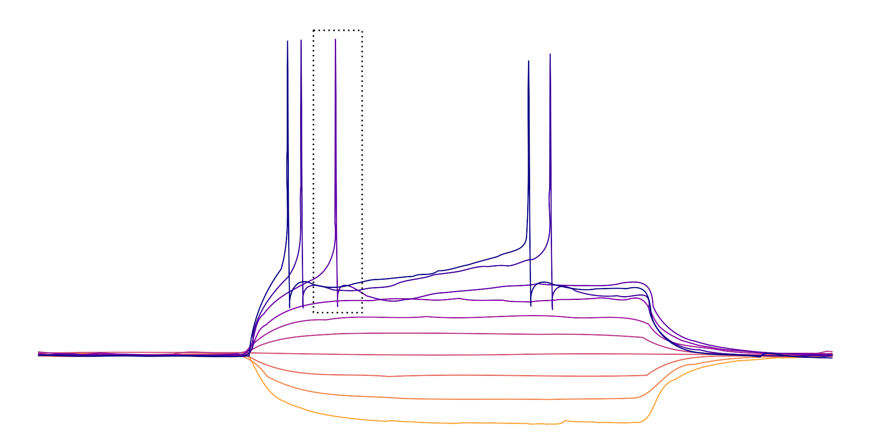
```

> You will identify the threshold using the first derivative method.
> This means that the threshold corresponds to the membrane potential
> where the action potential velocity is 10 mV/ms or greater (Farries et
> al., 2010).

## Set up data sheet

Before you begin, you should set up a .csv file. I would suggest using a
consistent naming scheme that includes the date. I use the
`YYYYMMDD-title.csv` format, such as `20250113-AP-analysis.csv`. This
makes it easy to identify when I last analyzed my data, and the files
sort easily.

In your .csv file, fill row 1 with the following column titles. Notice
that all (except for `ID` are in lowercase.

-   `letter` The unique letter identifier of a single cell. You can use
    this to link data from different recordings taken from the same
    cell.
-   `state` A character value. In this example, the values are
    `Baseline` and `Insulin`, indicating a current clamp protocol taken
    after the cell had been exposed to 500 nM insulin for 25 minutes.
-   `time_of_threshold` A numerical value (in ms) used to determine
    properties like the latency to fire.
-   `t_x` The membrane potential at the moment that an action potential
    is initiated, also known as the threshold.
-   `t11` The derivative of the trace you are analyzing. Must be 10
    mV/ms or greater to properly identify the threshold.
-   `ID` A character value indicating the recording number. This
    corresponds to the `File Name` column that is automatically
    generated in the Results sheet in Clampfit.
-   `first_sweep_with_APs` A number representing the earliest sweep
    number where action potentials first appeared.
-   `trace_start` This is an automatic value calculated by Clampfit, and
    it corresponds to the sweep number. It is not used in any analyses,
    but it will automatically be included in the Results sheet in
    Clampfit. It's faster to just copy all the data rather than try to
    exclude this value.
-   `peak_amplitude` The membrane potential (in mV) during maximum
    depolarization.
-   `time_to_peak` The time of the peak amplitude (in ms), which should
    also be relative to the `time_of_threshold` if you have repositioned
    Cursor 1 to the `time_of_threshold`.
-   `antipeak_amplitude` The afterhyperpolarization amplitude (in mV)
-   `time_of_antipeak` The time of the after-hyperpolarization (in ms),
    which should be relative to the `time_of_threshold`.
-   `half-width` The width of the action potential when the membrane
    potential is half of the `peak_amplitude`.

```{r ap-properties-image, fig.alt = "An image of an action potential with labels indicating properties such as the peak amplitude, half-width, after-hyperpolarization, and latency to fire."}
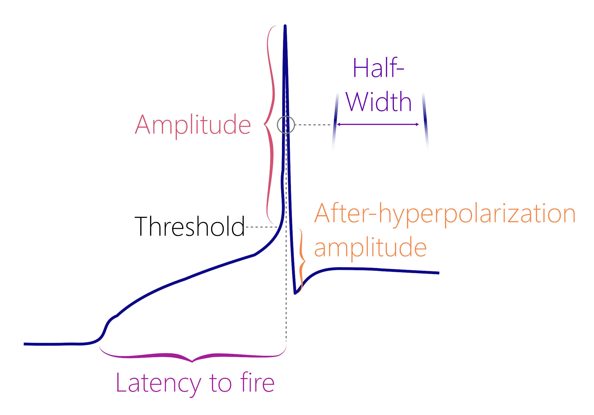
```

## Get derivative

1.  Open the .abf file containing the current clamp step protocol in
    Clampfit. Ensure that the x-axis shows time in milliseconds. If it
    shows seconds, double-click the x-axis, and change the
    `Elapsed Time` from `Automatic` to `Milliseconds`.

> **Warning!** The y-axis values should generally be around -70 mV
> during the flat regions outside of the current injection. Sometimes
> the scaling factor in Clampfit is distorted (for unknown reasons) and
> the y-axis may be in the thousands range. If this happens, follow step
> 1b).

1b. If the y-axis scale is off (see the warning box above), double-click
on the y-axis to open the `Modify Signal Parameters` box. Change the
`V/pA` ratio to 0.01, and click "OK". This will re-scale the y-axis to
the correct units relative to the current injections. Double-check that
the x-axis is in milliseconds!

```{r fix-y-axis, fig.cap = "Sometimes the V/pA ratio is altered, so you may need to change it to 0.01.", fig.alt = "A screenshot of a dialog box in Clampfit with an option to change the V/pA ratio to 0.01."}
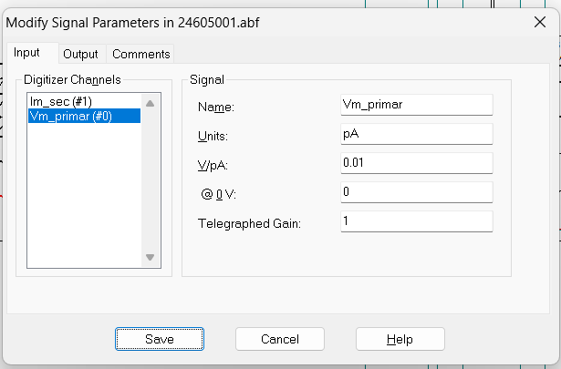
```

2.  Press the “Enter” key to show just one sweep at a time. It will
    begin at the sweep corresponding to the lowest current injection.
    Use greater than symbol (`>`) to cycle up through the sweeps.

3.  Move up to sweeps corresponding to higher current injections until
    you identify the first sweep that contains an action potential. I
    will call this `t_x`, since it may be `t5` in one recording, or `t6`
    in another, etc.

4.  Position Cursors 1 and 2 around the first action potential in `t_x`.
    Cursor 1 should be before the threshold (aim for the area before the
    slope of the curve increases steeply). Cursor 2 should be in the
    after-hyperpolarization region.

```{r cursor-placement, fig.cap = "The ideal placement of Cursor 1 should be in the middle of the curve. Left: Cursor 1 is placed where the curve is very steep, and it is likely that you will miss the threshold. Middle: Cursor 1 is very low, so Clampfit may identify this as the after-hyperpolarization. Right: This is the ideal spot, where the cursor is early enough to capture the threshold in the search region.", fig.alt = "A screenshot of an action potential with a green dot indicating the position of cursor 1. Cursor 1 should be at the middle portion of the curve, not the beginning of the curve (too early) or near the peak (too late)."}
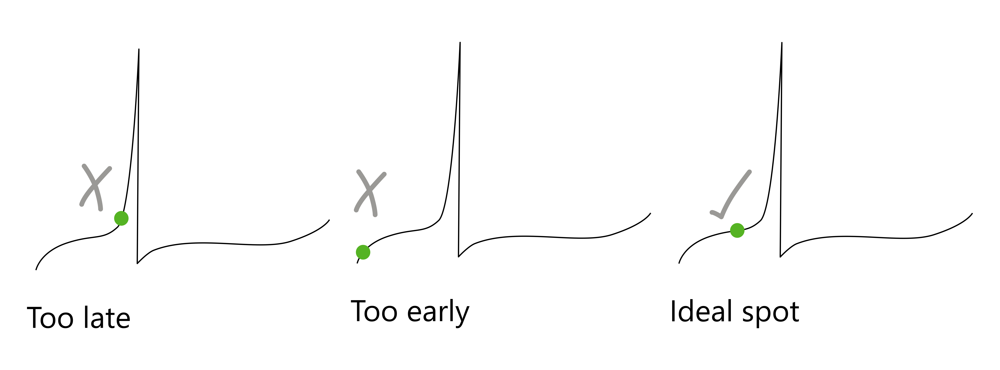
```

> **Warning!** It is important that Cursor 2 touches the curve at a
> value that is lower than the voltage value for Cursor 1. If Cursor 1
> is lower, then Clampfit may identify the location at Cursor 1 as the
> after-hyperpolarization region if you forget to move the cursor to the
> threshold (see step 11).

```{r cursor-image, fig.alt = "A screenshot of Clampfit showing cursors positioned around the first action potential. The first cursor is located at a point with a y-axis value that is greater than Cursor 2."}
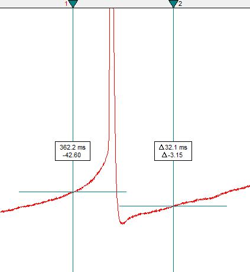
```

5.  Click on the arithmetic button (it is the button with basic math
    symbols), then Add Traces. Write "1" and click OK. This will add a
    new empty trace, called `t11`.

6.  `t11` should be the derivative of `t_x`. In the `Expression` box,
    write `t11=diff(t6)` (replace `t6` with your value for `t_x`).

```{r expression-image, fig.alt = "A screenshot of the Arithmetic box of Clampfit showing the formula t11=diff(t6) inserted into the expression field."}
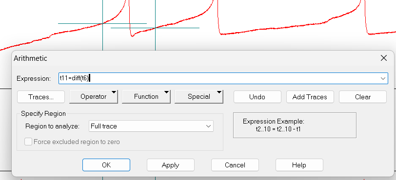
```

## Find threshold

7.  Click on `Edit` -\> `Transfer Traces` and set the
    `Region to transfer` as `Cursors 1..2`. In the `Trace Selection`
    category, choose only `Vm_primary ()` as the signal. Select `t_x`
    and `t11` for the traces, then click OK.

8.  Click on the Results sheet (`Window` -\> `Results1`). The `Results`
    page will display three columns: `Time (ms)`,
    `Trace #6 (or #5, #7, etc.)`, and `Trace #11`. `Trace #x` is the
    membrane potential in mV, and `Trace #11` is the derivative of
    `Trace #x`.

> **Warning!** The Results page of the transferred traces does not
> delete data between files. If you are doing several analyses in one
> session, ensure that you are looking at the correct columns
> corresponding to the active recording.

9.  Scroll down the `Trace #11` column (the derivative column) until you
    see a series of positive values with increasing magnitude (e.g. \>
    100 or more). This is where the derivative is increasing. Select the
    first value within this series that is greater than or equal to 10
    mV/ms. Copy the value of all three columns in this row.

> *Note* There may be isolated peaks within the derivative that are
> greater than 10 mV/ms. Only select this value if it is part of a
> series of increasingly larger positive values, followed by a series of
> negative values.

10. If the scaling is correct, the threshold (`t_x`) should be around
    -30 mV for a healthy cell. Your .csv file should now look like this:

```{r sample-ap-table-one}
sample_ap_data <- data.frame(
  letter = c("BN"),
  state = c("Baseline"),
  time_of_threshold = c(373.50),
  t_x = c(-32.10),
  t11 = c(10.38)
)

reactable(sample_ap_data)
```

## Measure action potential properties {#measure}

11. Double-click on Cursor 1 and change its x-position value (`time`) to
    match the `time_of_threshold`.

```{r cursor-image-revised, fig.alt = "A screenshot of Clampfit showing cursors positioned around the first action potential. The first cursor is now located at the x-value where the membrane potential is equal to the threshold.", fig.cap = "Note how Cursor 1 is shifted to the right relative to the earlier cursor image. It is now located at the x-value where the membrane potential crosses the threshold."}
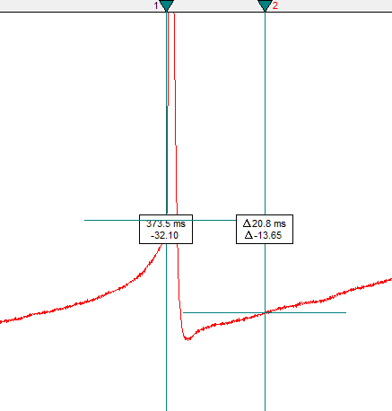
```

> **Warning!** If you do not reposition Cursor 1 to be at the time of
> threshold, the values for `time_of_peak` and `time_of_antipeak` will
> be incorrect!

12. Click on the Statistics button (a small icon with a summation symbol
    on top of it) or press `Alt+s`.

13. Set the following settings:

-   Trace Selection: Choose `Vm_primary ()` and `t_x` (in this case,
    `t6`) ONLY. Do NOT include `t11`.
-   Peak Polarity: `Vm_primary`, `Positive-going`
-   Baseline Region: Fixed at
    `[paste in the threshold value (column t_x in your sheet) here]`
-   Search Region 1: Range: `Cursors 1..2`
-   Destination Option: `Replace results in sheet` (prevents you from
    accidentally copying old data
-   Column Order: `Measurement, Region, Signal`
-   Measurements: `peak_amplitude`, `time of peak`,
    `antipeak amplitude`, `time of antipeak`, `half-width`

Click OK and then `Window` -\> `Results1` to see the Results page.

```{r statistics-box, fig.alt = "A screenshot of the Statistics box of Clampfit showing the correct options to select."}
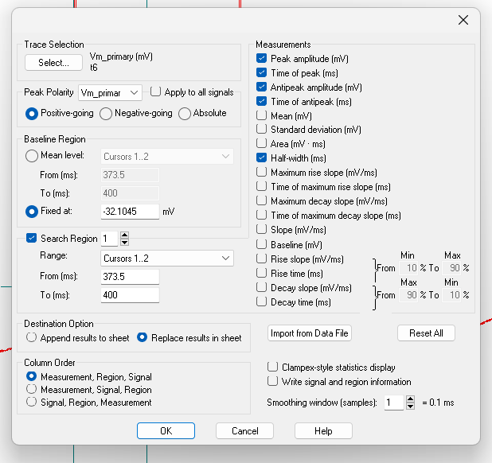
```

14. Select all data except for the `File Path` column (unless you think
    you will need it later) and paste it into the .csv file. You'll
    notice that the .csv column names are different than the column
    names in the `Results` sheet. I changed these column names to make
    them easier to use in R code.

15. Your .csv file should now look like this.

```{r finalized-ap-table}
sample_ap_data_2 <- data.frame(
  letter = c("BN"),
  state = c("Baseline"),
  time_of_threshold = c(373.50),
  t_x = c(-32.10),
  t11 = c(10.38),
  ID = c("23711003.abf"),
  first_sweep_with_APs = c(6),
  trace_start = c(5021),
  peak_amplitude = c(72.54),
  time_to_peak = c(0.7),
  antipeak_amplitude = c(-17.73),
  time_of_antipeak = c(4.4),
  half_width = c(1.09)
)

reactable(sample_ap_data_2)
```

16. While you still have this file open, you may want to count action
    potentials (see the section on [counting action potentials](#count)
    below).

17. A completed dataset should look something like the spreadsheet
    below.

> *Note* If there are no action potentials in the later recording,
> insert the values for the columns `letter` and `state` and leave all
> the others blank.

```{r example-full-ap-table}
sample_full_ap_table <- read.csv("sample-ap-data.csv") %>%
  mutate(across(where(is.numeric), \(x) round(x, 2)))

reactable(sample_full_ap_table)
```

18. You are now ready to import your data into R! Use the
    `add_new_cells()` function with `data_type = "AP_parameter"`. You
    may find it helpful to read the [Get
    Started](https://christelinda-laureijs.github.io/patchclampplotteR/articles/patchclampplotteR.html)
    guide if you are setting up your data for the first time.

19. Use the `plot_AP_comparison()` function to see how parameters like
    `peak_amplitude` and `half-width` change after your treatment.

```{r ap-comparison, fig.alt = "A plot of peak amplitude in pico amps versus state (baseline or insulin). The data are coloured according to state, where baseline points are gray and insulin points are purple. Insulin decreased action potential amplitude."}
plot_AP_comparison(
  sample_AP_data,
  plot_treatment = "Control",
  plot_category = 2,
  y_variable = "peak_amplitude",
  y_axis_title = "Peak Amplitude (pA)",
  theme_options = sample_theme_options,
  baseline_label = "Baseline",
  test_type = "wilcox.test",
  post_hormone_label = "Insulin",
  treatment_colour_theme = sample_treatment_names_and_colours,
  save_plot_png = "no"
)
```

## Count action potentials {#count}

The next step is to count the number of action potentials in each sweep.
This will allow you to later make a plot of action potential frequency
vs. current injection and see how a treatment affect action potential
frequency.

18. Create a separate .csv file (for example
    `20250113-AP-count-data.csv`). This file should have four columns:

-   `letter` The unique letter identifier of a single cell.
-   `state` A character value ("Baseline" or "Insulin" in this example)
-   `sweep` A number from 1 to 10 (see step 18a to generate this)
-   `no_of_APs` a numerical value indicating the number of action
    potentials

18a. To generate a repeated sequence from 1-10 quickly, type the number
1 in cell `C2`. Then, type the number 2 in cell `C3`.

18b. Select `C2` and `C3` together, then hover your mouse over the
bottom right corner of the group until you see a small black plus
symbol.

```{r excel-plus, out.width="25%", fig.alt = "A screenshot of Excel with two cells selected. A plus symbol is present on the bottom right corner of the selection."}
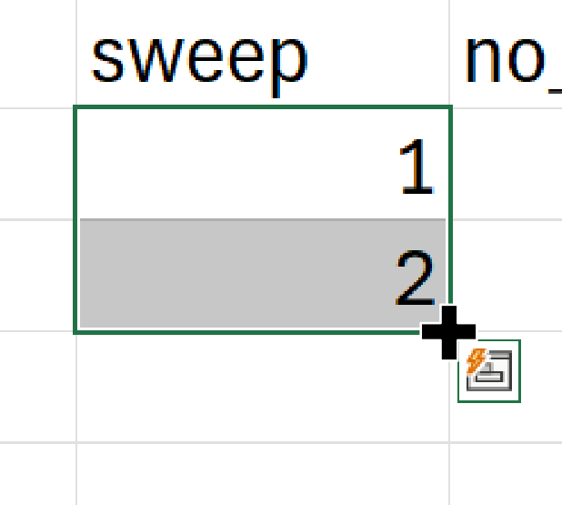
```

18c. Click and hold down the mouse key and drag the selection down to
`C11` to generate a sequence from 1 to 10.

18d. The entire range from `C2` to `C11` should be selected. Move your
mouse to the bottom right corner of the cell until you see the `+`
symbol again. Hold down the `Ctrl` key and drag this selection down.
This will generate the sequence from 1-10 repeatedly (e.g. 1, 2, 3, 4,
5, 6, 7, 8, 9, 10, 1, 2, 3...)

18e. You can then copy and paste this range repeatedly to fill your
column.

19. Open a current clamp steps recording in Clampfit (you may be coming
    directly from step 16 when you [measured action potential
    properties](#measure)).

20. Press the `Enter` key to view one sweep at a time, and use `<` and
    `>` to cycle through the sweeps. Count the number of action
    potentials in each sweep, and record them in the `no_of_APs` column.

> Yes, this step may seem super simple, but that's because it is - look
> at each sweep and count the number of action potentials present!

21. Here is an example of what one recording could look like:

```{r display-sample-count-data}
reactable(read.csv("sample-ap-count-data.csv"))
```

22. You are now ready to import the data into R! Use `add_new_cells()` with `data_type == "AP_count"`.

23. Here is an example of the type of plots you can create!

```{r ap-frequencies-one-treatment, fig.alt = "A plot of Action Potential Frequency in Hz versus current injection on the x-axis. The data are coloured gray for baseline data and purple for insulin data. The plot is showing that action potential frequency was lower after adding insulin."}
plot_AP_frequencies_single_treatment(
  data = sample_AP_count_data,
  plot_treatment = "Control",
  plot_category = 2,
  baseline_label = "Baseline",
  hormone_added = "Insulin",
  treatment_colour_theme = sample_treatment_names_and_colours,
  large_axis_text = "no",
  test_type = "wilcox.test",
  theme_options = sample_theme_options,
  save_plot_png = "no"
)
```

```{r ap-plot-frequencies-multiple-treatments, fig.alt = "A smoothed line plot showing action potential frequency in Hz versus current injection in picoamps for four different treatments at two states (baseline vs. insulin). Overall, insulin decreased action potential frequency in all treatments.", message=F}
plot_AP_frequencies_multiple_treatments(
  data = sample_AP_count_data,
  include_all_treatments = "yes",
  plot_category = 2,
  treatment_colour_theme = sample_treatment_names_and_colours
)
```


## FAQ

*What do I do if there are no action potentials following treatment?*

Do not discard this cell; this is important and meaningful data! Fill in
only the letter and state, and leave all other columns blank. R will
fill this with NA values, since there are no action potential properties
to measure. However, for your AP count data, please just indicate `0`
for all current injections.

*What do I do if there are action potentials outside of the time when a
current injection was applied?*

```{r aps-outside, fig.alt = "A screenshot of a recording in Clampfit showing action potentials present outside of the range where a current injection was applied."}
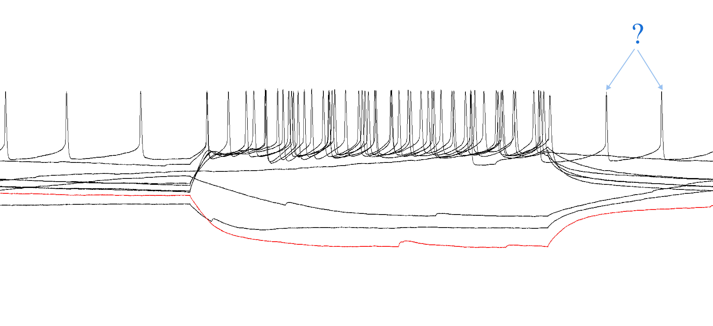
```

This can happen with very excitable cells. Only count the action
potentials that occurred within the injection period.

*Should I count an action potential that looks very wavy?*

```{r aps-wavy, fig.alt = "A screenshot of a recording in Clampfit showing wavy action potentials. Valid action potentials are indicated with check marks"}
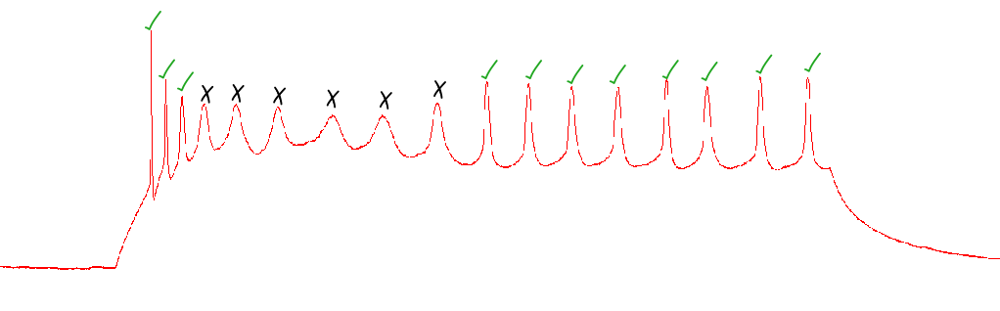
```

Only include the action potential if it clearly crosses the threshold,
comes to a sharp peak, and has an after-hyperpolarization period.

References

Farries, M. A., Kita, H., & Wilson, C. J. (2010). Dynamic Spike
Threshold and Zero Membrane Slope Conductance Shape the Response of
Subthalamic Neurons to Cortical Input. Journal of Neuroscience, 30(39),
13180–13191. <https://doi.org/10.1523/JNEUROSCI.1909-10.2010>
