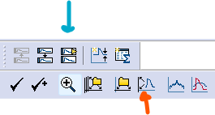

```{r spontaneous-setup, include = FALSE}
knitr::opts_chunk$set(
  fig.align = "center",
  out.extra = "",
  out.width = "75%",
  echo = FALSE
)

library(reactable)
```

The goal of spontaneous current analysis is to identify and analyze currents while avoiding spikes from stimulus artifacts and noise. This article will show you how to analyze spontaneous currents in raw .abf recordings using Event Detection in Clampfit. The data will then be ready for further analyses with `patchclampplotteR`.

```{r noise-figure, fig.alt = "An image of a current clamp steps recording with annotations. Large spikes are true currents and small spikes are noise."}

```


There are many advanced approaches to noise exclusion in electrophysiological recordings (see [Wang et al., 2023](https://doi.org/10.1073/pnas.2315804121); [Kudoh & Taguchi, 2002](https://doi.org/10.1016/S0956-5663(02)00053-2); and [Pernía-Andrade et al., 2012](https://doi.org/10.1016/j.bpj.2012.08.039) for some methods). I am using a simple threshold method, where any spikes below the threshold are not counted as synaptic events.

```{r noise-threshold-figure, fig.alt = "An image of a current clamp steps recording with annotations. After adding a threshold, only currents are identified."}

```

In this method, the threshold is five times the standard deviation (SD) of the noise amplitudes during a flat baseline region. This is comparable to the root mean square noise (RMS) used in MiniAnalysis.

## Combine recordings

> *Note* The data from our lab is not a continuous 30-minute recording. We pause the recording every 5 minutes to obtain parameters like access resistance and capacitance from the membrane test before resuming recording. If your data is already a continuous file, you can skip steps 1-2.

> You may already have a concatenated file from your [Evoked current analysis](https://christelinda-laureijs.github.io/patchclampplotteR/articles/evoked-current-analysis.html). This also means you can skip steps 1-2.

1. Open the first .abf file in your recording series, and use the `Next File` button to quickly open all files in the series.

2. Click on `Analyze` -> `Concatenate Files` and select all files that belong to a recording from a single cell. All the recordings will be combined into a continuous recording with no gaps. 

```{r concatenate, fig.alt = "A screenshot of the Concatenate files dialog box in Clampfit showing that all files are selected."}

```

## View recording

3. Click on the `Show Aquistion Signals` button and then `Previous Signal` (blue arrow in the figure below) to view the sweeps showing changes in current (`Im_primary ()`). The traces should all be stacked on top of each other, but if they are not, click on `View` -> `Data Display` -> `Sweeps`.

4. You can also click on the `Auto Scale All Y Axes` button (orange arrow) to help you see the data faster.

```{r viewer-buttons, out.width="25%", fig.alt = "A screenshot of the Show Signals buttons and other viewering buttons available in the upper toolbar in Clampfit."}

```

## Create data sheet

5. Create a .csv file with six columns: `Letter`, `ID`, `Trace`, `Peak_amplitude` and `Time_of_peak`.  

* `Letter` The unique letter identifier of a single cell.
* `ID` A character value indicating the recording number. This corresponds to the `File Name` column that is automatically generated in the Results sheet in Clampfit. See below for a warning about what you should put here.
* `Trace`
* `Peak_amplitude` 
* `Time_of_peak`

> *Note* I would strongly recommend using the filename of the first file in the series (but write down the concatenated filename in your lab book as well). This is because Clampfit will auto-generate the concatenated file names (`Concatenate001.abf`, `Concatenate002.abf`, etc.). If you update your pClamp software, Clampfit will begin naming files again at `Concatenate000.abf`, and you could lose track of which file is which.

## Identify threshold

> To reduce the risk of identifying noise as spontaneous currents, we must set a detection threshold.

6. Zoom into a region of the recording with few spontaneous currents and minimal noise. Place Cursors 1 and 2 around this region.

```{r baseline, fig.alt = "A screenshot of a recording in Clampfit with cursors surrounding a relatively flat region of the recording.", fig.cap = "Cursors 1 and 2 are surrounding a good baseline region."}
knitr::include_graphics("figures/Spont-currents-baseline.png")
```

> You may need to view a smaller number of traces if there are too many to find a clear region. Use `View` -> `Select sweeps` and select a smaller range.

7. Click on the Statistics button (a small icon with a summation symbol on top
of it) or press `Alt+s`.

8. Set the following settings to measure noise amplitude in the baseline:

* Trace Selection: Choose `Im_primary ()` and `All Visible Traces`.
* Peak Polarity: `Im_primary`, `Negative-going`
* Baseline Region: Mean level `Cursors 1..2`
* Search Region 1: Range: `Cursors 1..2`
* Destination Option: `Replace results in sheet` (prevents you from accidentally copying old data)
* Column Order: `Measurement, Region, Signal`
* Measurements: `Peak_amplitude`

9. Click on the Results sheet (`Window` -> `Results1`). On the results page, copy the values in the `R1S1 Peak` column. Paste these into the A column of a blank Excel sheet.

10. In cell B1, type the formula `=AVERAGE(A:A)`. This will produce the mean noise amplitude.

11. In cell B2, type the formula `=STDEV.S(A:A)` to get the standard deviation.

12. In cell B3 type `=B2*5`. This value is the five times the standard deviation of the mean noise amplitude, and it will be the threshold value for this recording (write this in your lab book near your notes on this recording).

13. You may want to save this Excel sheet for later use (just replace the data in the A column each time).

## Set Event Detection parameters

14. Click on `Event Detection` -> `Threshold search`. The recording will look faded, and some new horizontal cursors will appear. Set the Event Polarity to `Negative-going`.

15. In the `Threshold Search` box, set the Baseline to 0 and Trigger (pA) to the threshold value that you found in step 12.

16. If there are large artifacts, enable the `Reject cursor` and drag it to a level below the artifacts. Any event with an amplitude larger than this reject zone will be excluded.

> *Note* If you need to remove an entire trace, click on it and press the `Delete` key. This will hide the trace Later, you will select visible traces for the analysis.

17. If you are having issues with noise detection, feel free to experiment with the other settings such as the pre- and post-trigger lengths and noise rejection.

18. Set the search region to `Full Trace`. Click the `Select` button and ensure that the option `All Visible Traces` is selected.

```{r search-box, fig.alt = "A screenshot of the Event Detection Search Box in Clampfit.", fig.cap="You can double-check that you have selected the correct number of sweeps (here it should be t1..360) by checking the total sweep number in the bottom right corner (Sweep 360 of 360)."}
knitr::include_graphics("figures/Threshold-search-box.png")
```

19. Click OK to close the dialog box. If you ever need it again, click on the `Search Parameters` button on the bottom left side of the toolbar.

```{r search-parameter-buttons, out.width="25%", fig.alt = "A screenshot of the Search Parameters button available in the lower toolbar in Clampfit."}
knitr::include_graphics("figures/Search-parameter-button.png")
```

## Identify currents

20. Click on the `Full Scale X Axis` button to view the entire trace.

```{r full-scale, out.width="25%", fig.alt = "A screenshot of the Full Scale X Axis button available in the lower toolbar in Clampfit."}
knitr::include_graphics("figures/Full-scale-x-axis.png")
```
> **Warning!** If you do not check "Full Scale X axis", Clampfit will continuously scroll through the recording and it will take much longer to run.


21. The Event viewer window should pop up, but if not, click on the Event Viewer button. On the lower-right side, click the `Options` button, and then do the following: 

* Uncheck `Open Event Viewer automatically when starting event detection`
* Uncheck `Continuous autoscale`
* Close the Event Viewer window

```{r event-viewer, out.width="25%", fig.alt = "A screenshot of the Event Viewer button available in the lower toolbar in Clampfit."}

```

> **Warning!** If you do not close the Event Viewer (and perform the other items in Step 21), Clampfit will try to refresh and resize this window each time a current is detected. It will likely freeze and crash the software.

21. Click on the Nonstop button to initiate Event Detection. Clampfit will draw a blue dot on each event. This may take a few minutes for large files.

```{r nonstop, out.width="25%", fig.alt = "A screenshot of the Nonstop button available in the lower toolbar in Clampfit."}
knitr::include_graphics("figures/Nonstop-button.png")
```

22. When the Event Detection has stopped, the nonstop button will become greyed out there will be a small notification sound. This is what the recording will look like after all events have been detected.


```{r finished, fig.alt = "A screenshot of the recording after Event Detection is complete. Currents are highlighted in blue.", fig.cap = "In this screenshot, events are highlighted in blue with a sketch of the event placed above. There are so many spontaneous currents, that the sketches have turned into a solid blue bar!"}
knitr::include_graphics("figures/Event-detection-finished.png")
```

## Exclude evoked currents

Since this analysis focuses on spontaneous currents only, you will need to exclude any stimulus artifacts and evoked currents that were included in the event detection. Clampfit does not have an easy way to select multiple currents at once. However, one work-around is to create a plot of current amplitude over time and select points to delete.

```{r labelled-currents-figure, fig.alt = "A screenshot of a recording with evoked currents highlighted in blue, and spontaneous currents highlighted in green."}
knitr::include_graphics("figures/Labelled-currents-diagram.png")
```


23. Click on the `Define Graphs` button and choose the `Scatterplot` option.

```{r define-graphs-button, out.width="25%", fig.alt = "A screenshot of the Define Graphs button available in the lower toolbar in Clampfit."}
knitr::include_graphics("figures/Define-graphs-button.png")
```

24. Set the x-axis to `Time of Peak` and the y-axis to `Peak amplitude`.

25. You will see a plot that shows blue dots arranged in a rough shape that resembles the blue dots in the recording file in Step 22.

> Note, I have analyzed a file with fewer sweeps to reduce run-time and strain on my computer while making this tutorial.

> Note: The newer version of Clampfit (from pClamp 11) appears to be applying a rounding function to the graph, which creates parallel lines of dots. In reality, spontaneous currents are not perfectly aligned like this.

26. Click and hold down your cursor button and highlight the dots corresponding to the evoked currents and stim artifacts.


```{r time-to-peak-graph, fig.alt = "A screenshot of a plot of peak amplitude in pico amps over time to peak in milliseconds, with evoked currents highlighted in a bold blue outline.", fig.cap = "In this screenshot, notice how the stimulus artifacts are grouped together in one place. I have selected these points with my mouse."}
knitr::include_graphics("figures/Event-detection-graph-screenshot.png")
```


27. Go back to the recording file and check that the selected values correspond to the stim artifacts and evoked currents. You may need to repeat steps 26 and 27 a few times to make sure that you have selected all non-spontaneous current events.

28. Click on the `Process Selection` button that looks like a yellow triangle overlapping a blue triangle. 

```{r process-selection-button, out.width="25%", fig.alt = "A screenshot of the Process Selection button available in the lower toolbar in Clampfit."}

```
29. A dialog box will pop up. In the `Process` selection, click on `Change state` and then `Reject`.

30. When you are confident that you have removed all of the stim artifacts and evoked currents, it is time to save the results sheet. Click on the Results sheet (`Window` -> `Results1`) and `Save As`. I would suggest creating a consistent naming convention, such as `Letter`-events, as in `AA-events.sta`, `AB-events.sta`, etc.

## Copy required columns

31. Create a `.csv` file with five columns:

* `letter` A character value that is a unique identifier for a single recording. Used to link data sets for evoked or spontaneous currents and
cell-characteristics.
* `ID` A character value for the recording filename.
* `recording_num` A numeric value representing the recording number.
This was incorporated before we switched to concatenating all recordings
into one, but it needs to remain here to prevent breaking previous projects.
It should be set to 1.
* `trace` A numeric value representing the trace (automatically
generated in Clampfit) where the current occurred.
* `amplitude` A numeric value representing the amplitude of the evoked
current in pA.
* `time_of_peak` A numeric value representing the time of the peak in
milliseconds relative to trace number. This is automatically calculated in
Clampfit.

32. Paste in the values from your results sheet.

33. Repeat for the number of recordings that you need to analyze.

34. You are now ready to import your data into R! Use the `add_new_cells()` function with `data_type = "sEPSC"`. You may find it helpful to read the [Get Started](https://christelinda-laureijs.github.io/patchclampplotteR/articles/patchclampplotteR.html) guide if you are setting up your data for the first time.


## FAQ

*There are some noisy traces or traces with strange artifacts.*

You can exclude individual traces (for example ones with lots of noise or a very unstable baseline) in the Trace Selection box of Step 11. Select the traces you want to exclude, then `Invert` your selection.

```{r messy-sweep, fig.alt = "A screenshot of a recording with a very noisy sweep highlighted in red.", fig.cap="It will be difficult to accurately identify true currents in this sweep."}
knitr::include_graphics("figures/Messy-sweep.png")
```

