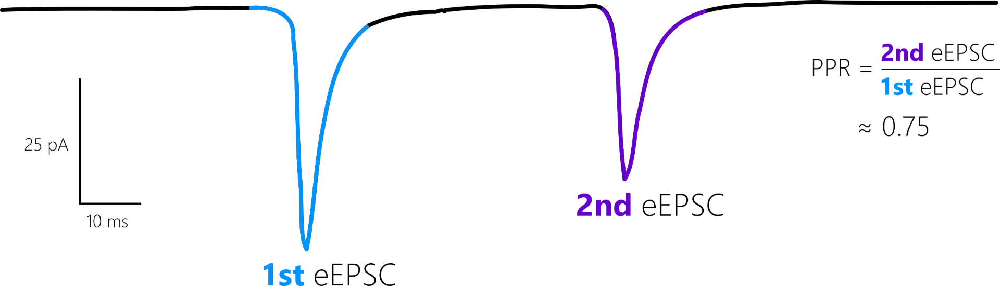
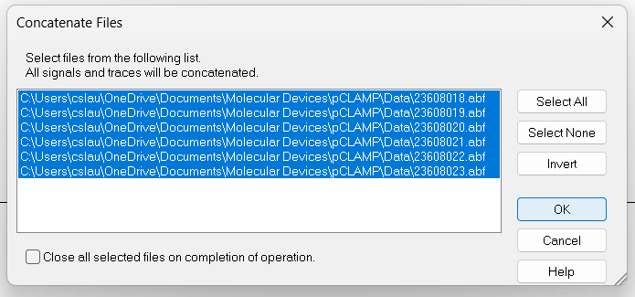
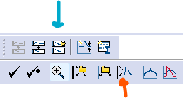
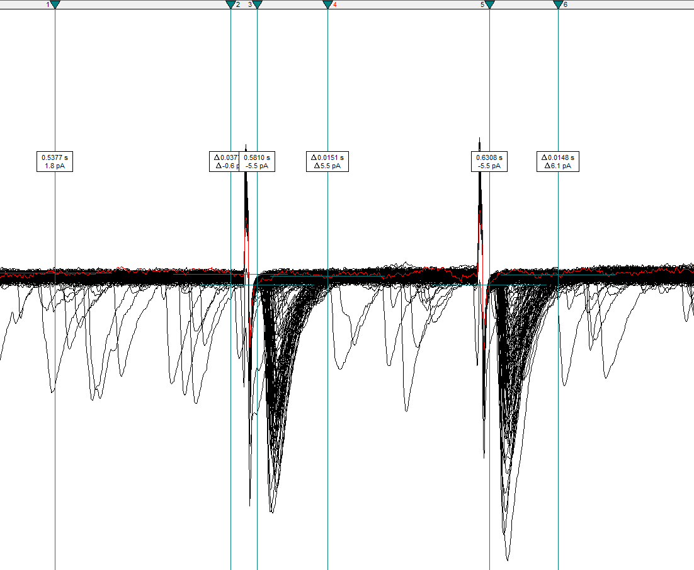
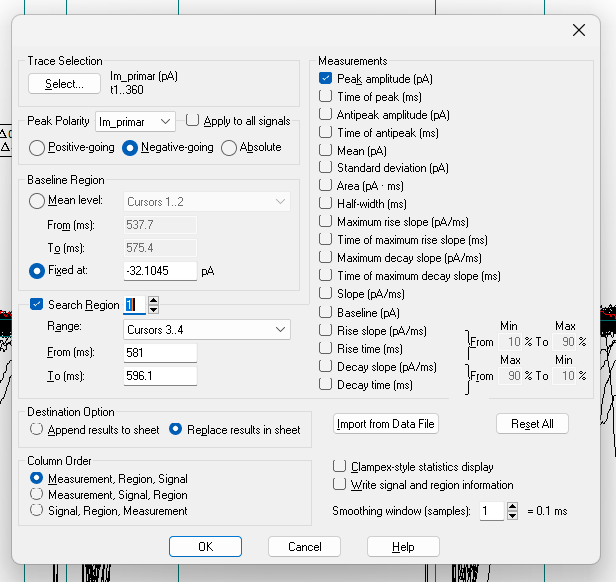
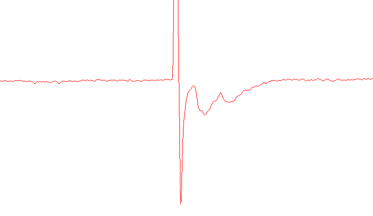

```{r, include = FALSE}
knitr::opts_chunk$set(
  fig.align = "center",
  out.extra='',
  out.width="75%",
  echo = FALSE
)
```

Before using `patchclampplotteR`, you will need to prepare your raw recording data from Clampfit. This vignette will show you how to move your evoked post-synaptic current data from raw .abf recordings to a .csv file.

This demonstration uses a protocol with two stimuli resulting in two evoked currents per sweep. The paired-pulse ratio (PPR) is the ratio of the second evoked current amplitude to the first.

```{r evoked-currents-schematic, fig.alt = "A sketch showing a horizontal line with two downward-pointing peaks separated by a short distance. These are the two evoked currents.", fig.cap = "This drawing shows the first and second evoked currents. The ratio between them is the paired-pulse ratio (PPR)"}

```

## Combine recordings

> The data from our lab is not a continuous 30-minute recording. We pause the recording every 5 minutes to obtain parameters like access resistance and capacitance from the membrane test before resuming recording. If your data is already a continuous file, you can skip steps 1-2.

1. Open the first .abf file in your recording series, and use the `Next File` button to quickly open all files in the series.

2. Click on `Analyze` -> `Concatenate Files` and select all files that belong to a recording from a single cell. All the recordings will be combined into a continuous recording with no gaps. 

```{r concatenate, fig.alt = "A screenshot of the Concatenate files dialog box in Clampfit showing that all files are selected."}

```

## Create data sheet

3. Create a .csv file with four columns: `Letter`, `ID`, `P1`, `P2`.

* `Letter` The unique letter identifier of a single cell.
* `ID` A character value indicating the recording number. This corresponds to the `File Name` column that is automatically generated in the Results sheet in Clampfit. See below for a warning about what you should put here.
* `P1` The amplitude of the first evoked current.
* `P2` The amplitude of the second evoked current.

> I would strongly recommend using the filename of the first file in the series (but write down the concatenated filename in your lab book as well). This is because Clampfit will auto-generate the concatenated file names (`Concatenate001.abf`, `Concatenate002.abf`, etc.). If you update your pClamp software, Clampfit will begin naming files again at `Concatenate000.abf`, and you could lose track of which file is which.

## View data

4. Click on the `Show Aquistion Signals` button and then `Previous Signal` (blue arrow in the figure below) to view the sweeps showing changes in current (`Im_primary ()`). The traces should all be stacked on top of each other, but if they are not, click on `View` -> `Data Display` -> `Sweeps`.

5. You can also click on the `Auto Scale All Y Axes` button (orange arrow) to help you see the data faster.

```{r viewer-buttons, out.width="25%", fig.alt = "A screenshot of the Show Signals buttons and other viewering buttons available in the upper toolbar in Clampfit."}

```

## Set up cursors

6. You will only need to set this up once per computer. Double-click anywhere in a blank region on the graph to open the `Analysis Window Properties` box.

7. In `Cursor Options`, increase the number of cursor pairs to 3. These 3 pairs will be used to set the baseline, first evoked current, and second evoked current.

8. Position Cursors 1 and 2 before the first stimulus artifact. Cursors 3 and 4 should surround the first evoked current, and Cursors 5 and 6 should surround the second evoked current.

```{r evoked-currents-cursors, fig.alt = "A screenshot of the correct cursor alignment in Clampfit."}

```

> Warning! Ensure that the cursors fully enclose the evoked currents and that they do NOT include the stimulus artifacts. 

9. Click on `View` -> `Window Defaults` and `Save selected Analysis Windows settings as default`. This will save you time when running through many analyses since it will restore your cursor pairs to the same position with new files!

## Get current amplitudes

10. Click on the Statistics button (a small icon with a summation symbol on top
of it) or press `Alt+s`.

11. Set the following settings:

* Trace Selection: Choose `Im_primary ()` and `Select All` traces. If you want to exclude specific traces, click on these traces, then select `Invert` to choose all traces *except* the ones you excluded.
* Peak Polarity: `Im_primary`, `Negative-going`
* Baseline Region: Mean level `Cursors 1..2`
* Search Region 1: Range: `Cursors 3..4`
* Search Region 2 (toggle up and check to enable a second search region): Range: `Cursors 5..6`
* Destination Option: `Replace results in sheet` (prevents you from accidentally copying old data
* Column Order: `Measurement, region, Signal`
* Measurements: `Peak_amplitude`

> Warning! Ensure that you have selected all traces that you want to include in the recording! You can verify if this is the correct number by checking the total number of sweeps in the bottom-right corner.

> Ensure that all the settings are correct, especially if you have done other analyses in Clampfit recently. For example, the polarity may be set to `Positive-going`, and you may have incorrect search regions specified if you were recently [analyzing action potential data](https://christelinda-laureijs.github.io/patchclampplotteR/articles/action-potential-analysis.html).

> The Measurements options change for each search region, so make sure that both search regions only have `Peak_amplitude` checked!

```{r evoked-currents-statistics, fig.alt = "A screenshot of the correct statistics options selected in Clampfit."}

```

12. Click OK and view the `Results` sheet. Copy the R1S1 and R2S1 columns, which correspond to the first and second evoked currents, respectively.

13. Paste these values into the `P1` and `P2` columns.

14. Fill in the `Letter` and `ID` columns. In Excel, you can just fill the first values, then double-click the cell in the bottom right corner to automatically fill the entire column.

You are finished with the analysis in Clampfit!

## Cell Characteristics

15. Create a new .csv file. This will eventually become a large spreadsheet with information on all recordings in your entire dataset. As you add new recordings, update this cell characteristics sheet. Please see the **Required columns** section of the documentation for `import_cell_characteristics_df()` for explanations of the required columns and what they include.

16. After you have completed these steps for several recordings, you should have two .csv files:

* A .csv file with the evoked current amplitudes (`P1` and `P2`)
* A .csv file containing information on the cell characteristics

If you have these two files, you are ready to begin using `patchclampplotteR`! See the [Getting Started vignette](https://christelinda-laureijs.github.io/patchclampplotteR/articles/patchclampplotteR.html) to learn how to combine this data and use it with `patchclampplotteR`.


## FAQ

*There are some traces with significant amounts of noise*

You can exclude individual traces (for example ones with lots of noise or a very unstable baseline) in the Trace Selection box of Step 11. Select the traces you want to exclude, then `Invert` your selection.

*What does it mean when there are two currents close together?*

```{r multivesicular-release, fig.alt = "A screenshot of a recording with two currents after a stimulation. This is an example of multivesicular release."}

```

If you see two peaks instead of one expected evoked current, this could be an example of multivesicular release. Make a note of this, since the treatment could lead to changes in synaptic activity through this interesting mechanism.

*I have some new recordings. Do I add them to my existing .csv files, or make new files?*

You should save a new .csv file for each new batch of raw data (these are the .csv files with `Letter`, `ID`, `P1` and `P2`). You may find it efficient to wait until you have a week of recordings, then analyze these recordings all at once in Clampfit. These data will be in a .csv file named something like "20240708-eEPSC-data.csv".

However, when writing a paper or thesis, you will use just one master csv file which contains the evoked current data for all recordings in the entire project. To append new data to this master csv, use the `add_new_cells()` function. Please see the [Getting Started vignette](https://christelinda-laureijs.github.io/patchclampplotteR/articles/patchclampplotteR.html) for more details.
