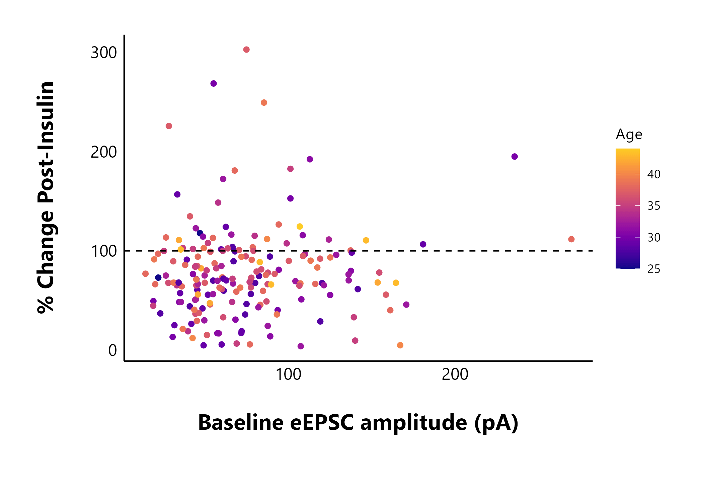

```{r knit-options-libraries, include = FALSE}
knitr::opts_chunk$set(
  collapse = TRUE,
  comment = "#>",
  fig.align = "center"
)

library(reactable)
library(dplyr)
```

# How to use patchclampplotteR

`patchclampplotteR` is an exciting new package that will help you analyze and plot your patch clamp data
efficiently. This vignette will walk you through the complete process of
transforming raw data into publication-quality plots!

## Set up R Project

To use this package, set up a new folder on your computer. Give the folder a
short, distinctive name with no spaces (use hyphens instead). I would strongly
recommend adding subfolders with names like `Data`, `Figures`, and `Thesis`.
This will help with organization and make it easier to expand to future
projects, like writing your thesis in R.

```{r folder-structure, echo=F, out.width="25%", out.extra = "", fig.alt = "A screenshot of the file structure of a typical project. There are folders for data, figures, scripts, and the thesis.", fig.cap = "A screenshot of the file structure of a typical project. There are folders for data, figures, scripts and the thesis. Files with a '.' in the name, like .gitignore or .Rhistory, are automatically generated when you set up your project. If you aren't using git to track your files, don't worry about the filenames that start with 'git'"}
knitr::include_graphics("Directory.png")
```


In RStudio, click on `File` -> `New project` -> `Existing Directory` and choose
the folder you just created. Click on `Create Project` and R will refresh to a
blank, new project. You're now ready to create a new R Markdown (.Rmd) file and
start your analysis!

## Install and load package

You can install the development version of patchclampplotteR from
[GitHub](https://github.com/christelinda-laureijs/patchclampplotteR). Only do this once per computer, or if there's a major update.

```{r install-package-demo, eval=F, warning=FALSE, message=FALSE}
pak::pak("christelinda-laureijs/patchclampplotteR")
```

And then load the package each time you want to use it:

```{r load-library}
library(patchclampplotteR)
```

## About the data

This sample dataset consists of whole-cell patch clamp recordings of neurons within the
dorsomedial hypothalamus (DMH), a brain region critical for appetite regulation,
stress responses and other processes. I recorded evoked excitatory post-synaptic
currents for five minutes under baseline conditions, then added 500 nM insulin
to the perfusion solution, and I continued recording for 25 minutes.

> My goal is to determine if insulin affects evoked current amplitude in DMH
neurons.

## Analyze data in Clampfit

Please see the vignettes in the Articles page to learn about how to analyze data in Clampfit. These include [Evoked Current Analysis](https://christelinda-laureijs.github.io/patchclampplotteR/articles/evoked-current-analysis.html), [Spontaneous Current Analysis](https://christelinda-laureijs.github.io/patchclampplotteR/articles/spontaneous-current-analysis.html), and [Action Potential Analysis](https://christelinda-laureijs.github.io/patchclampplotteR/articles/action-potential-analysis.html).

## Import raw .csv files

### Cell Characteristics

First, I must import a `.csv` file containing information about factors such as
the animal's age and sex, the cell ID number, and other details. Please see the
**Required columns** section below for full explanations of the required columns and
what you should include. There is also a link to download an empty `.csv` file with the headers required for this dataset:

```{r download-sample-blank-cell-characteristics, echo=F}
xfun::embed_file("sample-blank-cell-characteristics-sheet.csv")
```

#### Required columns

The columns listed below are required in the raw .csv file. If you do not have data for any of these columns, please still include the column as an "empty" column to prevent errors caused by missing columns.

> Don't worry about missing data! R will automatically fill blank cells with 'NA' values, which will be ignored in the analyses.

 * `letter` A character value that is a unique identifier for a single
recording. You can use this link recordings that came from the same cell. For example, from cell "A" you may have action potential recordings, evoked current data, and spontaneous current data.
 * `cell` A character or numeric value representing the cell. For
example, use `3.1.1` for animal #3, slice #1, cell #1.
 * `sex` A character value such as "Male" or "Female".
 * `X` A numeric value representing the x-value of the cell's location in
µm. (Leave blank if you don't have this).
 * `Y` A numeric value representing the y-value of the cell's location in
µm.  (Leave blank if you don't have this).
 * `age` A numeric value representing the animal's age. Can be any value
as long as the time units are consistent throughout (e.g. don't mix up days
and months when reporting animal ages). Do not use characters (e.g. Do NOT write
`P31`. Use `31` instead).
 * `animal` A numeric value representing the animal's ID number.
 * `synapses` A character value such as "Glutamate" or "GABA".
 * `treatment` A character value such as "Control" or "HNMPA".
 * `category` A numeric value representing an experiment type. For example, '1' may mean 4 seconds of high-frequency stimulation (HFS), '2' may mean an experiment where you added insulin, and '3' may mean HFS with insulin in the bath at all times. A category is the top-level division of your data. You can then have subgroups using the `treatment` variable. For example, perhaps you added insulin (Category `2`) and also had the antagonist HNMPA present. This would be `Category = 2, Treatment = HNMPA`.
 
```{r treatment-schematic, echo=F, out.width="100%", out.extra = "", fig.alt = "A diagram showing two rows of data. The first has the text Category = 2 (add insulin), while the second row has Treatment, followed by the words "Control", "HNMPA", "PPP" and "HNMPA + PPP". The goal of this figure is to show that treatments are nested under category."}
knitr::include_graphics("Treatment-schematic.jpg")
```
 
 * `R_a` A list of values for the access resistance, which would have been
monitored at several timepoints throughout the recording. See the section
`R_a` formatting below.
 * `days_alone` A numeric value representing the number of days that the animal was alone in a cage. This will always be 1 for some treatments, like fasting, but should ideally be low to reduce the effects of social isolation-related stress.
 * `animal_or_slicing_problems` A character value ("yes" or "no") indicating if there were any problems during any point of the slice preparation process or animal handling. For example, use "yes" if the slices were crumpling during slicing or the animal was unusually anxious.)

> Note: Since you are using an R Project, it is easy to identify files in sub-folders. For example, you can
write `import_cell_characteristics_df("Data/cell_info.csv")` to use
`cell_info.csv` located within the `Data/` subfolder.

```{r import-cell-characteristics, eval=T, echo=F, warning=FALSE, message=FALSE}
cell_characteristics <- import_cell_characteristics_df(import_ext_data("sample_cell_characteristics.csv"))
```

```{r display-import-cell, eval=F, echo=T}
cell_characteristics <- import_cell_characteristics_df("sample_cell_characteristics.csv")

cell_characteristics
```

```{r display-cell-characteristics, echo=F}
reactable(cell_characteristics)
```

### Raw evoked current data

Next, I will import the raw evoked current data that has been copied over from
Clampfit (again, please see the [Evoked Current Analysis vignette](https://christelinda-laureijs.github.io/patchclampplotteR/articles/evoked-current-analysis.html) for details about how to analyze this data in Clampfit. This is a `.csv` file containing four columns: `letter`, `ID`, `P1`
and `P2`:

* `letter`: A unique identifier for a single recording, which allows you to link evoked current data, spontaneous current data, action potential, data, and information on cell characteristics.

* `ID`: The name of the .abf filename used to obtain the data, which is useful for verifying the recordings and cross-referencing to your lab book.

* `P1`: The amplitude of the first evoked current (pA).

* `P2`: The amplitude of the second evoked current (pA).

> Try to match the capitalization of the column names to the examples listed here. If you do forget to make them lowercase, don't worry.
`add_new_cells()` will automatically convert all column names to lowercase for
consistency across functions. Capitalized letters will be retained for columns
like `ID`, `X`, `Y`, `P1`, and `P2`.

```{r display-sample-evoked-data, eval=F, echo=T}
sample_eEPSC_data <- read.csv("sample_new_eEPSC_data.csv")

sample_eEPSC_data
```

```{r sample-eEPSC-data, eval=T, echo=F}
sample_eEPSC_data <- read.csv(import_ext_data("sample_new_eEPSC_data.csv"))

reactable(sample_eEPSC_data)
```

## Add new cells

The next step is to merge the raw evoked current data with the cell
characteristics data. `add_new_cells()` will merge these two datasets, using
`letter` as the common column. This function requires three `.csv` files:

* The new raw data
* The cell characteristics
* An existing `.csv` with raw data that has been previously imported. As your
project goes on, you will eventually be appending new data onto your existing
datasheet, but if you are starting completely fresh, use a blank `.csv` file
containing just one value in cell `A1` called `letter`. This column title is all that is needed to allow R to auto-fill in the rest of the new data.

> **WARNING!!** If you are starting from an empty `.csv` file, the `.csv` in the `old_raw_data_csv` argument MUST contain at least the `letter` column name in cell A1. If you try to use a completely empty `.csv` sheet, R will not recognize it as a valid `.csv` because there is "nothing" for it to read if it is a blank csv. 

```{r blank-sheet-screenshot, echo=F, out.width="50%", out.extra = "", fig.alt = "A screenshot of what your starting csv file should look like the first time you begin a dataset."}

```

Use the `add_new_cells()` function, and carefully read the warning messages.

```{r display-add-new-cells, echo=T, eval=F}
first_time_df <- add_new_cells(
  new_raw_data_csv = "sample_new_eEPSC_data.csv",
  cell_characteristics_csv = "sample_cell_characteristics.csv",
  old_raw_data_csv = "empty_old_raw_data_sheet.csv",
  data_type = "eEPSC",
  write_new_csv = "no",
  new_file_name = "",
  decimal_places = 2
)
```

```{r add-new-cells-first-time, eval=T, echo=F}
first_time_df <- add_new_cells(
  new_raw_data_csv = import_ext_data("sample_new_eEPSC_data.csv"),
  cell_characteristics_csv = import_ext_data("sample_cell_characteristics.csv"),
  old_raw_data_csv = import_ext_data("empty_raw_datasheet.csv"),
  data_type = "eEPSC",
  write_new_csv = "no",
  new_file_name = "",
  decimal_places = 2
)
```

### Check output messages

`add_new_cells()` produces several warnings and messages. One warning lets you
know you know that the column names have been renamed to lowercase. This is to
avoid case-sensitive issues from appearing in later functions.

The first message generated with `add_new_cells()` indicate that the
`sample_cell_characteristics.csv` and `sample_new_eEPSC_data.csv` have the same
cells. This is useful to catch if you forget to add the cell characteristics for
the new data.

The second message indicates that all letters in the new data are new relative
to the existing dataset. This ensures that you don't accidentally paste in the
same data twice, resulting in duplicated data.

The final message prints a list of the letters that have been added to the
dataset. In this case, these are "FX", "GR" and "HC". It is a good way to confirm that you've
added the letters you were planning to add.

You can also ask R to produce a list of all of the unique letters in the dataset. This won't catch duplicates, but it can help you identify if a letter is completely missing from the dataset. See, `FX` is now included!

```{r view-unique-letters}
unique(first_time_df$letter)
```

This is an example of what the full few rows look like now:

```{r view-new-data-table, echo=F}
head(first_time_df, n = 8) %>%
  reactable()
```

As you collect more data, change the value of `old_raw_data_csv` from the empty sheet to your existing raw data sheet. This function will automatically append new data onto your existing sheet and save it to a new `.csv` file (defined by `new_file_name`). I am saving it to the `Data/` subfolder.

```{r add-new-cells, eval=F, echo=T}
add_new_cells(
  new_raw_data_csv = "sample_new_eEPSC_data.csv",
  cell_characteristics_csv = "sample_cell_characteristics.csv",
  old_raw_data_csv = "Data/Raw-eEPSC-df.csv",
  data_type = "eEPSC",
  write_new_csv = "no",
  new_file_name = "",
  decimal_places = 2
)
```

## Explore your data

Let's look at an example of a full dataset. This is the sample raw evoked current dataset included in the package. To reduce
the vignette size, I am printing just the first 20 rows. The full dataset
contains > 5680 rows!)

```{r display-raw-data, eval=F, echo=T}
head(raw_eEPSC_df, n = 20)
```


```{r view-sample-raw-data, echo=F}
raw_eEPSC_df <- sample_raw_eEPSC_df

head(raw_eEPSC_df, n = 20) %>%
  reactable()
```


You can use `dplyr` functions to quickly explore your data. Here's just one example of a quick and useful analysis:

### Count number of cells per sex and treatment

*Quick Tip*: Want to know how many experiments you still need to do? Run this line of code on the raw data. Here, I filtered the data to category 2 only (experiments where I added insulin) and grouped by treatment. I then counted the number of cells per sex.

```{r quick-group-stats, eval=F, echo=T}
raw_eEPSC_df %>%
  filter(category == 2) %>%
  filter(time == 0) %>%
  group_by(treatment) %>%
  count(sex) %>%
  arrange(treatment, sex)
```


```{r actual-quick-stats, eval=T, echo=F}
raw_eEPSC_df %>%
  filter(category == 2) %>%
  filter(time == 0) %>%
  group_by(treatment) %>%
  count(sex) %>%
  arrange(treatment, sex) %>%
  reactable()
```


## Define your colour theme

In this package, you only need to specify your treatment groups and colours once. You can later refer to this dataframe in `treatment_colour_theme` arguments for all of your plotting functions. The package is loaded with a sample dataframe to help you get started:

```{r see-built-in-colours, echo=F}
reactable(sample_treatment_names_and_colours)
```

`colours` and `very_pale_colours` are specified as hex codes or named R colours. The only difference between `treatment` and `display_names` is that the `display_names` are re-written to look attractive in plots and tables.

First, check out how many treatment groups you have using `unique(raw_eEPSC_df$treatment)`.

```{r see-unique-treatments}
unique(raw_eEPSC_df$treatment)
```
Next, modify this code to set up your own dataframe with your treatment names and colours.

```{r define-own-dataframe}
my_theme_colours <- data.frame(
  category = c(2, 2, 2, 2),
  treatment = c("Control", "HNMPA", "PPP", "PPP_and_HNMPA"),
  display_names = c("Control", "HNMPA", "PPP", "PPP\n&\nHNMPA"),
  colours = c("#f07e05", "#f50599", "#70008c", "#DCE319"),
  very_pale_colours = c("#fabb78", "#fa98d5", "#ce90de", "yellow")
)
```

Every time a plot contains the argument `treatment_colour_theme`, refer to your custom dataframe (`my_theme_colours` in this example). To see more information about defining your own theme, see the [Theme FAQ](https://christelinda-laureijs.github.io/patchclampplotteR/articles/FAQ.html#theme-faq).

## Analyze current amplitude

After you have finished a brief exploration of your data, it is time to analyze it!

### Step 1: Normalize currents

The first step is to normalize the current amplitudes within each recording
relative to the average current amplitude during the baseline period. This makes
it easier to compare across cells that have a wide range of starting amplitudes,
since all baseline values will be converted to (roughly) 100%.

> Note how I set the minimum and maximum time values. This will limit the data
to values between 0 min and 25 minutes.
>
> I set the `interval_length` to 5 because I wanted to divide my data into
5-minute intervals for later statistical analyses.
>
> The baseline period (`baseline_length`) lasted 5 minutes.
> Clampfit recorded the current amplitude as negative values, so I set
`negative_transform_currents` to "yes" which will flip the current amplitudes to
positive values.


```{r normalize-data, eval=F, echo=T}
raw_eEPSC_df <- make_normalized_EPSC_data(
  filename = "sample_eEPSC_data.csv",
  current_type = "eEPSC",
  min_time_value = 0,
  max_time_value = 25,
  interval_length = 5,
  baseline_length = 5,
  negative_transform_currents = "yes"
)
```

```{r echo=F, eval=T}
raw_eEPSC_df <- sample_raw_eEPSC_df
```


`make_normalized_EPSC_data()` will retain the cell characteristics and `P1` and
`P2` values from before. However, you will notice some changes.

If you set `negative_transform` to "yes", `P1` and `P2` will be multiplied by
`-1`. This is to "flip" current amplitude data that was recorded as negative
values in Clampfit. Since the data are evoked current data (`current_type =
"eEPSC"`), some new columns are added. They are:

* `PPR`: The paired-pulse ratio, which is the amplitude of the second evoked current divided by the first evoked current (`PPR = P2/P1`).

* `interval`: The interval that the data belongs to. I set the `interval_length` to 5, which means the data will be divided into 5-minute intervals. The intervals will have names like "t0to5", "t5to10", and so on up until the maximum interval.

* `baseline_range`: You probably won't interact with this much, but this is just a column stating "TRUE" if the time is within the baseline period, or "FALSE" if the time is outside of this range. This is required for the normalization function to identify which values are outside of the baseline (and should be transformed).

* `baseline_mean`: This is one number that represents the average evoked current amplitude during the baseline period. This value is different for each recording.

* `P1_transformed`: The first evoked current amplitude, normalized relative to the mean baseline amplitude. For example, if the mean baseline amplitude is **80 pA** and a `P1` value is **40 pA**, `P1_transformed` will be **50%**.

* `P2_transformed`: The second evoked current amplitude, normalized relative to the mean baseline amplitude of the first evoked current.

#### Plot raw data

Let's see what the raw values look like over time!

`plot_raw_current_data()` will generate a scatterplot of evoked current
amplitude (pA) over time (min) for all cells within the treatment and category
that you specify. Behind the scenes, this really runs a loop over each letter,
generating a ggplot object for each recording.

Please see the documentation for `plot_raw_current_data()` to learn about the
arguments in more detail.

```{r make-raw-plots}
raw_eEPSC_control_plots <- plot_raw_current_data(
  data = raw_eEPSC_df,
  plot_treatment = "Control",
  plot_category = 2,
  current_type = "eEPSC",
  y_variable = "P1",
  pruned = "no",
  hormone_added = "Insulin",
  hormone_or_HFS_start_time = 5,
  theme_options = sample_theme_options,
  treatment_colour_theme = sample_treatment_names_and_colours
)
```

`plot_raw_current_data()` will return a list of ggplot objects. If you want to
observe just one specific plot, you can select it by letter.  

```{r view-one-raw-plot, fig.alt = "A plot of evoked current amplitude (in pA) over time in minutes showing a decrease in evoked current amplitude after adding insulin."}
raw_eEPSC_control_plots$L
```

### Step 2: Prune data

It is often useful to summarize the data per minute. If you are familiar with
GraphPad Prism's "prune rows" function, `make_pruned_EPSC_data()` will perform
the same function.

> In this vignette, I'll use the example of pruning data per minute (`interval_length = 1`) because this
is what is typically used in the Crosby lab. You can change this value by
changing the `interval_length` to something other than `1`.

```{r prune-data}
pruned_eEPSC_df <- make_pruned_EPSC_data(
  data = raw_eEPSC_df,
  current_type = "eEPSC",
  min_time_value = 0,
  max_time_value = 25,
  baseline_length = 5,
  interval_length = 1
)
```

This function will return a list of three dataframes. To access each list, type *the object name, followed by a dollar sign*. For example, write `pruned_eEPSC_df$individual_cells` to access the first dataframe in the list.

```{r pruned-data-screenshot, echo=F, out.width="85%", out.extra = "", fig.alt = "A screenshot showing the text pruned_eEPSC_df with a dollar sign. There is a popup on the right showing the three available dataframes.", fig.cap = "In RStudio, typing up the name of the pruned dataset followed by the dollar sign will show a pop-up with the list of available dataframes."}
knitr::include_graphics("Pruned-data-dataframe-popup.jpg")
```

The three dataframes are:

* `$individual_cells`: This dataframe has the same structure as the raw evoked current data, except the data have been pruned per minute. New columns include `mean_P1` and `sd_P1`, and there are some other columns for variance analysis (please see the documentation for `make_pruned_EPSC_data()` for more details).

* `$for_table`: This dataframe has only two columns: `letter` and `P1_transformed` where the pruned `P1` values have been collapsed into a list. This is used to create a sparkline in `make_interactive_summary_table()`.

* `$all_cells`: This dataframe contains data that have been grouped by treatment and sex. In this dataframe, the data have been summarized and collapsed into one datapoint per minute for all cells per minute for a specific sex. This is useful for creating summary plots for publication (e.g. `plot_summary_current_data()`) and for future statistical testing to compare groups.

#### Plot pruned data

You can use the same `plot_raw_current_data()` to plot the pruned data. You will
need to make changes to the following arguments:

* `data`: Refer to the third element of the list produced from `make_pruned_EPSC_data()`. This is `$individual_cells`.
* `y_variable`: Change this to "mean_P1".
* `pruned`: Change this to "yes"

```{r plot-pruned-current-data}
pruned_eEPSC_control_plots <- plot_raw_current_data(
  data = sample_pruned_eEPSC_df$individual_cells,
  plot_treatment = "Control",
  plot_category = 2,
  current_type = "eEPSC",
  y_variable = "mean_P1",
  pruned = "yes",
  hormone_added = "Insulin",
  hormone_or_HFS_start_time = 5,
  theme_options = sample_theme_options,
  treatment_colour_theme = sample_treatment_names_and_colours
)
```

```{r plot-pruned-cell-L, fig.cap = "See how this is the same as the raw data plot, except for it is pruned per minute?", fig.alt = "A plot of evoked current amplitude (in pA) over time in minutes showing a decrease in evoked current amplitude after adding insulin. This is the same plot as the raw plot from earlier, but there are fewer data points because this is the pruned dataset."}
pruned_eEPSC_control_plots$L
```


#### Perform T-tests

The pruned data from all cells within a specific treatment and sex (`$all_cells`) will enable you to make a summary plot using `plot_summary_current_data()`. Before moving forward, you should perform a t-test assessing changes in the evoked current amplitude for each 5-minute interval relative to the baseline period.

Use the `perform_t_tests_for_summary_plot()` function, and give the object a useful name. You will later insert this object into the `t_test_df` argument of `plot_summary_current_data()`.

```{r evoked-t-test-table}
evoked_t_test_results <- perform_t_tests_for_summary_plot(
  data = sample_summary_eEPSC_df$summary_data,
  test_category = 2,
  include_all_treatments = "yes",
  list_of_treatments = NULL,
  current_type = "eEPSC",
  parameter = "amplitude",
  baseline_interval = "t0to5",
  interval_length = 5,
  treatment_colour_theme = sample_treatment_names_and_colours,
  save_output_as_RDS = "no"
)
```

```{r actual-t-test, eval=T, echo=F}
reactable(evoked_t_test_results)
```

#### Plot summary data


> Notice how `data` is now `sample_pruned_eEPSC_df$all_cells`, and `y_variable` is "amplitude". There are lots of customization opportunities when plotting summary data, including adding a representative trace as a .png overlay! You can read more about in the documentation for `plot_summary_current_data()`.


```{r display-plot-summary-data, echo=F, eval=F}
plot_summary_current_data(
  plot_category = 2,
  plot_treatment = "Control",
  data = sample_pruned_eEPSC_df$all_cells,
  current_type = "eEPSC",
  y_variable = "amplitude",
  include_representative_trace = "yes",
  included_sexes = "both",
  representative_trace_filename = "Figures/Representative-traces/Control-trace.png",
  significance_display_method = "stars",
  y_axis_limit = 175,
  signif_stars = "yes",
  t_test_df = evoked_t_test_results,
  hormone_added = "Insulin",
  large_axis_text = "no",
  shade_intervals = "no",
  hormone_or_HFS_start_time = 5,
  treatment_colour_theme = sample_treatment_names_and_colours,
  theme_options = sample_theme_options
)
```


```{r plot-summary-data, warning=F, echo=F, message=FALSE, fig.alt = "A scatterplot showing evoked current amplitude (% baseline) versus time in minutes, where 500 nM of insulin have been added from 5 minutes and onwards. Insulin significantly decreased current amplitude in both males and females."}
plot_summary_current_data(
  plot_category = 2,
  plot_treatment = "Control",
  data = sample_pruned_eEPSC_df$all_cells,
  current_type = "eEPSC",
  y_variable = "amplitude",
  include_representative_trace = "yes",
  included_sexes = "both",
  representative_trace_filename = import_ext_data("Control-trace.png"),
  significance_display_method = "stars",
  y_axis_limit = 175,
  signif_stars = "yes",
  t_test_df = evoked_t_test_results,
  hormone_added = "Insulin",
  large_axis_text = "no",
  shade_intervals = "no",
  hormone_or_HFS_start_time = 5,
  treatment_colour_theme = sample_treatment_names_and_colours,
  theme_options = sample_theme_options
)
```

> **Warning!!** If you change `included_sexes` to "male" or "female", you MUST remember to use a t-test that uses the dataset that has been filtered to include **one sex only**! If you do not do this, the significance stars will not match (e.g. it may show the t-test stars for both sexes, but only one sex is visible).

### Step 3: Summarize data

The next step is to group the data by treatment by sex and obtain summary data. `make_summary_EPSC_data()` will generate a list of 2 dataframes. One dataframe (accessible with `$summary_data`) grouped the data into intervals and generated summary statistics (like mean and standard error) for each point. The interval length was already
specified during the `make_normalized_EPSC_data()` function from earlier.

```{r make-summary-data}
summary_eEPSC_df <- make_summary_EPSC_data(
  data = sample_raw_eEPSC_df,
  current_type = "eEPSC",
  save_output_as_RDS = "no",
  baseline_interval = "t0to5",
  ending_interval = "t20to25"
)
```

```{r reactable-summary-data, echo=F}
reactable(summary_eEPSC_df$summary_data)
```


### Step 4: Percent change data
The second dataframe (accessible with `$percent_change_data`) contains information on the percent change in evoked current amplitude `percent_change` during a specific time interval (`ending_interval`) relative to the baseline (`baseline_interval`). For example, if currents decreased by 50% after the hormone, the value of `percent_change` is 0.5.

```{r display-summary-percent-data-head, eval=F}
head(summary_eEPSC_df$percent_change_data, n = 30)
```

```{r summary-percent-data, eval=T, echo=F} 
head(summary_eEPSC_df$percent_change_data, n = 30) %>%
  reactable()
```

You can plot the percent change in current amplitude during the `ending_interval` relative to the `starting_interval`.

```{r}
plot_percent_change_comparisons(
  data = sample_summary_eEPSC_df$percent_change_data,
  plot_category = 2,
  current_type = "eEPSC",
  y_variable = "amplitude",
  treatment_colour_theme = sample_treatment_names_and_colours,
  theme_options = sample_theme_options
)
```


## Explore! Make your own plots!

You now have your data in an easy-to-manipulate format, and you have the freedom to choose what analysis you want to do next!

For example, you could look at the paired-pulse ratio, changes in variance parameters, or compare baseline values. See below for examples of how to use these functions.

### Looking at cell characteristics

Using `cell_characteristics` data throughout makes it very easy to answer interesting questions about your data. For example, does the baseline evoked current amplitude (data from `t0to5`) affect a cell's insulin sensitivity? I can use `percent_change` as a marker of the effect size of insulin.

> Note: The sample dataset included in this package is too small to show anything meaningful, so I'm including static images from my dataset (manuscript in preparation).

```{r baseline-amplitude-vs-percent-change, eval=T, echo=F, fig.align='center', fig.alt = "A  scatterplot showing baseline evoked current amplitude in pA on the x-axis and percent change in eEPSC amplitude after adding insulin on the y-axis."}

```

Does an animal's age affect the cell's sensitivity to insulin? In the following plot, I also coloured the points by the baseline evoked current amplitude to see if this would show any new patterns.

```{r age-vs-percent-change, eval=T, echo=F, fig.align='center', fig.alt = "A  scatterplot showing age in days on the x-axis and percent change in eEPSC amplitude after adding insulin on the y-axis."}

```

The next section shows some examples of functions in the package that you can try out.

## Analyze the paired-pulse ratio

### Create PPR dataset

The function `make_PPR_data()` is actually just a filtering function that will limit the raw evoked current data to two specific intervals. These represent the "before" (`baseline_interval`) and "after" (`post_hormone_interval`) states. You can also choose to limit the PPR values to a certain range to exclude outliers.

```{r make-ppr-data}
PPR_df <- make_PPR_data(
  data = raw_eEPSC_df,
  include_all_treatments = "yes",
  list_of_treatments = NULL,
  PPR_min = 0,
  PPR_max = 5,
  baseline_interval = "t0to5",
  post_hormone_interval = "t20to25",
  treatment_colour_theme = sample_treatment_names_and_colours
)
```


```{r display-head-ppr, eval=F, echo=T}
head(PPR_df, n = 10)
```


```{r actual-head-ppr, eval=T, echo=F}
head(PPR_df, n = 10) %>%
  reactable()
```


### Plot PPR data

For a specific treatment:

```{r plot-one-ppr-treatment, fig.alt = "A scatterplot of paired-pulse ratio over time (baseline or post-insulin) showing no difference in the paired pulse ratio across these two times.", warning=FALSE}
plot_PPR_data_single_treatment(
  data = PPR_df,
  plot_treatment = "Control",
  plot_category = 2,
  baseline_label = "Baseline",
  post_hormone_label = "Insulin",
  test_type = "t.test",
  large_axis_text = "no",
  treatment_colour_theme = sample_treatment_names_and_colours,
  theme_options = sample_theme_options,
  save_plot_png = "no"
)
```

For multiple treatments:

```{r plot-multiple-ppr-treatments, fig.alt="A grouped scatterplot showing paired-pulse ratio across state (baseline or post-insulin) for all four treatment groups. This plot demonstrates the plot_PPR_data_multiple_treatments function."}
plot_PPR_data_multiple_treatments(
  data = PPR_df,
  include_all_treatments = "yes",
  plot_category = 2,
  baseline_label = "B",
  post_hormone_label = "I",
  test_type = "t.test",
  theme_options = sample_theme_options,
  treatment_colour_theme = sample_treatment_names_and_colours
)
```

## Variance analysis

We can use variance measures like the coefficient of variation and the variance-to-mean ratio (VMR) to help determine if a mechanism is presynaptic or post-synaptic (see [van Huijstee & Kessels, 2020](https://doi.org/10.1016/j.jneumeth.2019.108526) for more details). This package contains functions such as `make_variance_data()` and `plot_variance_comparison_data()` to allow you to perform variance analysis quickly from summary evoked current data (e.g. data generated from `make_summary_EPSC_data()`).

### Create variance dataset

```{r make-variance-dataset}
variance_df <- make_variance_data(
  data = summary_eEPSC_df$summary_data,
  df_category = 2,
  include_all_treatments = "yes",
  list_of_treatments = NULL,
  baseline_interval = "t0to5",
  post_hormone_interval = "t20to25",
  treatment_colour_theme = sample_treatment_names_and_colours,
  save_output_as_RDS = "no"
)
```

```{r reactable-variance, echo=F}
reactable(variance_df)
```

### Plot variance comparisons

You can create plots comparing the inverse coefficient of variation squared, and the variance-to-mean ratio.

```{r variance-comparison-plots-cv-vmr-definition, fig.alt = "Figure 1. A scatterplot showing changes in the inverse coefficient of variation squared across time (baseline or post-insulin). Figure 2. A scatterplot showing changes in the variance-to-mean ratio across time."}
cv_comparison_control_plot <- plot_variance_comparison_data(
  data = variance_df,
  plot_category = 2,
  plot_treatment = "Control",
  variance_measure = "cv",
  baseline_interval = "t0to5",
  post_hormone_interval = "t20to25",
  post_hormone_label = "Insulin",
  test_type = "wilcox.test",
  large_axis_text = "no",
  treatment_colour_theme = sample_treatment_names_and_colours,
  theme_options = sample_theme_options
)

vmr_comparison_control_plot <- plot_variance_comparison_data(
  data = variance_df,
  plot_category = 2,
  plot_treatment = "Control",
  variance_measure = "VMR",
  baseline_interval = "t0to5",
  post_hormone_interval = "t20to25",
  post_hormone_label = "Insulin",
  large_axis_text = "no",
  test_type = "wilcox.test",
  treatment_colour_theme = sample_treatment_names_and_colours,
  theme_options = sample_theme_options
)

cv_comparison_control_plot
vmr_comparison_control_plot
```


## Compare baseline parameters

You can compare parameters across treatments during the baseline period. If `current_type` = "eEPSC", the allowed `y_variable` is "raw_amplitude". If `current_type` = "sEPSC", the allowed `y_variable` values are "raw_amplitude" or "raw_frequency".

> *Note*: It does not make sense to use normalized/baseline transformed amplitudes, since these will all be 100, and the graph will be a flat line.

```{r compare-baseline-parameters, fig.alt = "A grouped scatterplot showing the baseline evoked current amplitude across four treatment groups.", warning=FALSE}
plot_baseline_data(
  data = summary_eEPSC_df$summary_data,
  current_type = "eEPSC",
  plot_category = 2,
  y_variable = "raw_amplitude",
  include_all_treatments = "yes",
  list_of_treatments = NULL,
  baseline_interval = "t0to5",
  large_axis_text = "no",
  plot_width = 8,
  treatment_colour_theme = sample_treatment_names_and_colours,
  theme_options = sample_theme_options,
  save_plot_png = "no"
)
```

Hopefully this vignette has given you an idea of some of the plotting functions that this package can do. The documentation for each function contains lots of additional information about each argument, and you can also explore the articles for [Evoked Current Analysis](https://christelinda-laureijs.github.io/patchclampplotteR/articles/evoked-current-analysis.html), [Spontaneous Current Analysis](https://christelinda-laureijs.github.io/patchclampplotteR/articles/spontaneous-current-analysis.html), and [Action Potential Analysis](https://christelinda-laureijs.github.io/patchclampplotteR/articles/action-potential-analysis.html).

If you have any questions about customizing your plots, read the [FAQ](https://christelinda-laureijs.github.io/patchclampplotteR/articles/FAQ.html) page. There will likely be an answer there!

```{r millie-picture, echo=F, fig.align='center', fig.alt = "A picture of a knitted mouse laying down on several small sheets of paper with scatterplots on them.", fig.cap = "So much data! Millie the Mouse is exploring plots made with patchclampplotteR."}

```

